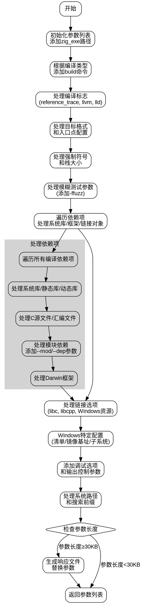

好的，我需要为这个Zig函数绘制流程图。首先，我需要理解这个函数的结构和逻辑。这个函数名为`getZigArgs`，看起来是用来生成编译参数列表的。函数接收一个`Compile`结构体指针和一个布尔值`fuzz`，返回一个二维的`u8`数组的数组，可能表示命令行参数。

首先，函数初始化了一个`ArrayList`来存储参数，添加了Zig可执行文件的路径。然后根据`compile.kind`选择不同的命令，比如`build-lib`、`build-exe`等。接着处理各种编译选项，比如`reference_trace`、`allow_so_scripts`、`use_llvm`、`use_lld`等。

接下来是关于目标格式`ofmt`的处理，入口点`entry`的设置，强制未定义符号`force_undefined_symbols`，栈大小`stack_size`，以及模糊测试`fuzz`的参数。

然后处理系统库、框架、链接对象等。这里涉及到遍历依赖项，处理静态库、动态库、C源文件、汇编文件等。同时处理模块的依赖关系，添加`--mod`和`--dep`参数。

之后是链接选项，比如是否链接libc、libcpp，处理Windows资源文件、清单文件，设置镜像基址，测试过滤器，调试选项，输出文件控制（生成asm、bin、文档等），压缩调试节，EH帧头，重定位，函数和数据节，垃圾回收节，动态库选项等。

还有处理系统库路径、搜索前缀、响应文件（当参数过长时写入文件）等。

最后，根据参数长度决定是否使用响应文件，避免命令行过长的问题。

为了绘制流程图，我需要将这些步骤分解成不同的节点，并用箭头表示流程。可能需要将代码块分解为主要的逻辑部分，比如初始化、处理编译选项、处理依赖项、处理链接选项、处理系统库、生成响应文件等。

需要注意的是，代码中有很多条件判断和循环，比如处理`link_objects`时的`switch`语句，遍历`modules`时的循环。这些需要在流程图中用条件分支和循环结构表示。

可能的结构：

1. 开始
2. 初始化参数列表，添加Zig可执行路径
3. 根据编译类型添加命令（build-lib等）
4. 处理各种编译标志（reference_trace, llvm, lld等）
5. 处理目标格式和入口点
6. 处理强制符号和栈大小
7. 处理模糊测试参数
8. 处理系统库和框架（遍历依赖项，处理静态库、动态库等）
9. 处理链接选项（libc, libcpp等）
10. 处理Windows相关选项（清单、资源文件等）
11. 添加调试和输出选项
12. 处理系统路径和搜索前缀
13. 检查参数长度，生成响应文件（如果需要）
14. 返回生成的参数列表

在流程图中，每个主要步骤对应一个节点，条件判断用菱形框表示，循环结构可能需要用箭头返回到之前的节点。

需要注意代码中的错误处理（`try`），但流程图可能不需要详细展示错误路径，除非特别重要。

可能需要使用子流程来简化复杂的部分，比如处理依赖项的部分，可以作为一个子流程节点。

最终，流程图应该清晰展示函数的主要逻辑步骤和关键决策点。
================================================
