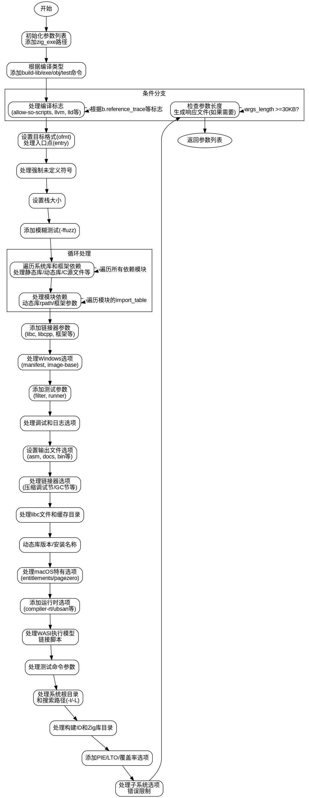

好的，我需要为这个Zig函数`getZigArgs`生成一个Graphviz流程图。首先，我需要理解这个函数的结构和逻辑流程。

这个函数的主要目的是构建并返回一个Zig编译器的命令行参数列表。它处理各种编译选项，如编译类型（库、可执行文件等）、链接选项、系统库、框架、调试设置等。流程涉及多个条件判断和循环，比如处理不同的编译类型、系统库的依赖、模块依赖、动态库的链接参数等。

首先，我应该将整个函数分解为主要的步骤或模块。例如：

1. 初始化参数列表，添加Zig可执行路径。
2. 根据编译类型（lib、exe等）添加对应的命令。
3. 处理各种编译标志，如`allow-so-scripts`、`llvm`、`lld`等。
4. 处理目标格式（ofmt）和入口点（entry）的设置。
5. 处理强制未定义符号。
6. 设置栈大小。
7. 处理模糊测试（fuzz）选项。
8. 处理系统库和框架的依赖，包括静态库、动态库、C源文件等。
9. 处理模块间的依赖关系，包括动态库的链接路径。
10. 添加链接器相关的参数，如库路径、框架、libc、libcpp等。
11. 处理Windows特定的选项，如清单文件、图像基址等。
12. 添加测试相关的参数，如测试过滤器、测试运行器等。
13. 处理调试和日志选项。
14. 设置输出文件选项，如生成汇编、文档等。
15. 处理链接器选项，如压缩调试节、重定位、GC节等。
16. 处理libc文件和缓存目录。
17. 设置库的版本和安装名称（针对动态库）。
18. 处理macOS特定的选项，如entitlements、页面大小等。
19. 添加编译器运行时和动态链接选项。
20. 处理WASI执行模型和链接脚本。
21. 处理测试命令参数。
22. 处理系统根目录和搜索路径。
23. 处理构建ID和Zig库目录。
24. 添加PIE、LTO、覆盖率等选项。
25. 处理子系统选项和错误限制。
26. 处理参数长度过长时的响应文件生成。

接下来，我需要确定这些步骤之间的逻辑关系。例如，初始化参数后，根据编译类型选择命令，然后依次处理各种标志和选项。循环部分，比如处理系统库和模块依赖，可能需要用循环结构表示。条件判断，如是否启用某个功能，需要用条件分支。

需要注意的是，某些步骤可能嵌套在条件或循环中。例如，处理系统库的部分有一个循环遍历所有依赖的编译单元，每个单元可能包含多个模块，每个模块又有自己的链接对象。这可能需要多层嵌套的结构。

此外，处理参数长度超过限制时，生成响应文件的步骤是一个独立的条件分支，应该在流程图的末尾部分处理。

在绘制流程图时，需要将这些步骤用适当的节点表示，并用箭头连接它们的执行顺序。条件判断使用菱形节点，循环使用带有返回箭头的结构。

可能遇到的挑战是如何简化复杂的逻辑，尤其是嵌套循环和条件，确保流程图清晰易读。需要将重复的部分抽象为子流程，或者合理分组步骤，避免节点过多导致混乱。

总结来说，流程图的大致结构是：开始 -> 初始化参数 -> 按编译类型添加命令 -> 处理各个标志和选项 -> 处理依赖和链接 -> 处理平台特定选项 -> 处理输出和调试 -> 处理参数长度 -> 结束。

现在，我需要将这些步骤转化为Graphviz的节点和边，确保逻辑正确，结构清晰。
================================================
