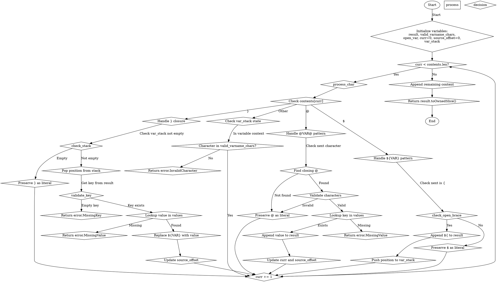

好的，我现在需要根据提供的Zig代码绘制流程图。首先，我需要理解这个函数的功能。函数名为expand_variables_cmake，看起来是用来处理类似于CMake中的变量展开。输入是一个字符串，可能包含变量占位符，比如${VAR}或者@VAR@，然后根据提供的values哈希映射来替换这些变量。

首先，我需要逐行分析代码的结构。函数开始初始化了一个结果数组，然后定义了一些变量，比如valid_varname_chars和open_var。接着进入一个主循环，遍历输入字符串的每个字符。

主循环中，有三个主要的case处理：'@'、'$'和'}'。每个符号对应不同的变量展开方式。例如，处理@VAR@这样的变量，或者${VAR}这样的变量。还有处理闭合括号'}'的部分，这时候需要从堆栈中取出对应的起始位置，完成变量的替换。

接下来，我需要考虑流程的分支。例如，当遇到'@'时，会检查后面是否有另一个'@'，如果没有，就视为普通字符处理。如果有，则提取变量名，查找对应的值，替换到结果中。处理'$'时，检查后面是否有'{'，如果有，则记录位置到堆栈中，处理变量名的开始。当遇到'}'时，从堆栈中取出开始位置，截取变量名，进行替换。

还有一些错误处理的情况，比如变量名包含无效字符，或者找不到对应的值，这时候会返回错误。此外，还有处理转义字符的情况，但这里好像没有特别处理反斜杠，只是继续循环。

在画流程图时，需要将这些逻辑分支都表示出来。比如主循环开始，检查每个字符，根据不同的字符进入不同的处理分支。每个分支内部的条件判断也需要用菱形框表示。例如，遇到'@'时，判断是否有闭合的'@'，变量名是否有效，是否存在于values中等等。

另外，需要注意堆栈的使用。在处理'${'时，将位置压入堆栈，处理'}'时弹出堆栈，并替换变量。这部分需要在流程图中体现堆栈操作的影响。

可能还需要处理循环结束后的剩余字符，即source_offset到结尾的部分，追加到结果中。

在绘制时，需要确保每个判断和操作步骤都有对应的图形元素，比如开始/结束的椭圆，过程的矩形，判断的菱形，以及箭头表示流程方向。同时，要避免遗漏任何可能的路径，比如处理无效字符时的错误返回，或者堆栈为空时遇到'}'的情况。

可能需要注意的几个关键点：

1. 主循环遍历每个字符。
2. 处理@VAR@的情况，包括查找闭合@，验证变量名，替换值。
3. 处理${VAR}的情况，使用堆栈跟踪起始位置。
4. 处理闭合}时，从堆栈弹出，替换变量。
5. 错误处理，如无效字符、缺失变量等。
6. 循环结束后处理剩余字符。
7. 结果返回。

现在需要将这些步骤转化为流程图的结构，确保每个条件判断和操作都有正确的表示。例如，主循环开始后，检查当前字符是否是@、$、}等，如果是，进入对应的处理流程。每个处理流程内部的条件判断也需要详细展开。

可能出现的错误包括变量未找到、无效字符、堆栈操作错误等，这些需要在流程图中用不同的路径表示，比如错误处理路径返回错误。

最后，生成结果字符串并返回。

总结来说，流程图应该从函数入口开始，初始化变量，进入主循环，逐个字符处理，根据不同的字符触发不同的处理逻辑，处理完成后追加剩余字符，返回结果。
================================================
