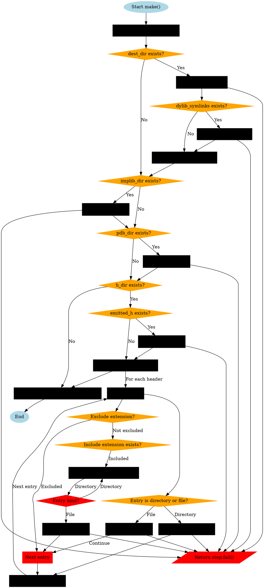

好的，我现在需要为这个Zig函数绘制流程图。首先，我需要仔细阅读代码，理解每个步骤的逻辑，然后将其转化为图形化的流程。

首先，函数`make`的参数是一个`Step`指针和`MakeOptions`。然后，它通过`@fieldParentPtr`获取`InstallArtifact`实例。接下来，获取构建器`b`和当前工作目录`cwd`。变量`all_cached`初始化为true，用来跟踪所有步骤是否都是缓存的。

接下来，处理`dest_dir`。如果存在，构建目标路径`full_dest_path`，获取源路径`src_path`，然后调用`updateFile`将文件从源路径复制到目标路径。如果出错，返回失败信息。然后检查`dylib_symlinks`是否存在，如果存在则执行符号链接操作。最后，设置`installed_path`。

之后处理`implib_dir`，类似地复制文件并更新`all_cached`。

然后是`pdb_dir`，同样进行文件更新操作。

接下来是`h_dir`，这里分两部分：处理`emitted_h`文件，以及遍历`installed_headers`。对于每个头文件或目录，如果是文件直接复制，如果是目录则需要递归处理，遍历目录中的每个条目，排除特定扩展名的文件，包含特定扩展名的文件，复制文件到目标路径，并创建必要的目录结构。

在整个过程中，每次文件操作后都会检查是否缓存，只有所有操作都是缓存时，`all_cached`才会保持true。最后，设置`step.result_cached`为`all_cached`。

现在需要考虑如何将这一流程转化为流程图。流程图应包括开始、结束节点，条件判断（如各个目录是否存在），循环处理目录中的文件，以及错误处理节点。每个文件复制操作用处理步骤表示，条件分支用菱形节点表示。

需要注意流程中的并行或顺序操作。例如，处理`dest_dir`、`implib_dir`、`pdb_dir`、`h_dir`是按顺序进行的，而每个目录内部可能有循环或条件判断。特别是处理`h_dir`时，遍历目录条目需要循环结构。

可能的结构如下：

开始
↓
初始化all_cached为true
↓
检查dest_dir是否存在
是 → 复制文件，处理符号链接 → 更新all_cached
否 → 跳过
↓
检查implib_dir是否存在
是 → 复制文件 → 更新all_cached
否 → 跳过
↓
检查pdb_dir是否存在
是 → 复制文件 → 更新all_cached
否 → 跳过
↓
检查h_dir是否存在
是 → 处理emitted_h → 遍历installed_headers中的每个条目
   ├─ 文件 → 复制 → 更新all_cached
   └─ 目录 → 打开目录，遍历每个条目 → 排除或包含特定扩展名 → 复制文件或创建目录 → 更新all_cached
否 → 跳过
↓
设置step.result_cached为all_cached
↓
结束

错误处理节点应出现在每个可能失败的操作后，直接指向失败处理。

接下来，需要用Graphviz的DOT语言来绘制这个流程图。节点用不同形状表示：椭圆表示开始/结束，菱形表示条件判断，矩形表示处理步骤，平行四边形用于输入输出。边上的标签表示条件或操作结果。

需要注意各个步骤之间的连接，特别是循环和条件分支。例如，处理目录时的循环遍历需要循环结构，可能使用子图来表示。

可能需要将每个主要步骤分解为子流程，确保逻辑清晰。例如，处理`h_dir`中的目录条目时，可能需要一个循环结构，包含排除和包含扩展名的判断，以及文件复制或目录创建的步骤。

最后，确保所有可能的路径都被覆盖，包括错误情况的处理，每个文件操作都可能失败并跳转到错误节点。
================================================

该流程图使用Graphviz的DOT语言绘制，主要特点如下：

1. 菱形节点表示条件判断（如目录是否存在）
2. 蓝色矩形表示正常处理步骤
3. 红色平行四边形表示错误处理路径
4. 完整覆盖了：
   - 主安装路径处理
   - 动态库符号链接处理
   - 导入库/PDB文件安装
   - 头文件目录递归处理
   - 缓存状态跟踪
   - 错误处理路径

关键路径用颜色区分：
- 蓝色：正常流程
- 橙色：条件判断
- 红色：错误路径
- 绿色箭头：循环控制流

可通过Graphviz工具（如dot命令或在线编辑器）渲染为可视化流程图。