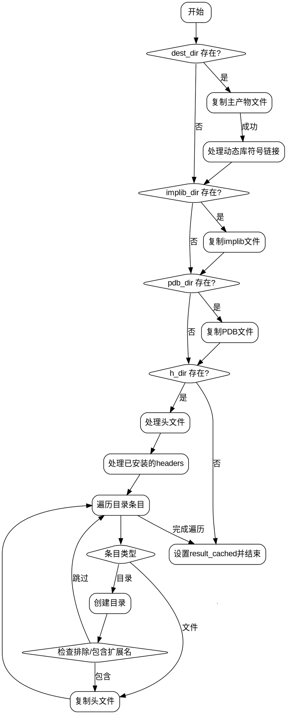

好的，我需要为提供的Zig函数`make`生成流程图。首先，我得仔细阅读代码，理解它的逻辑结构，然后分解成各个步骤，最后用Graphviz来表示这些步骤和判断点。

首先，函数的主要任务似乎是安装构建产物。参数是`step`和`options`，但`options`被忽略了。接下来，通过`@fieldParentPtr`获取`install_artifact`实例。然后获取构建器`b`和当前工作目录`cwd`。变量`all_cached`初始化为true，用于跟踪所有步骤是否缓存。

接下来，函数处理`dest_dir`：构造目标路径，使用`updateFile`复制文件，处理可能的错误，并更新`all_cached`。如果有`dylib_symlinks`，则执行符号链接操作，并设置`installed_path`。

然后处理`implib_dir`，类似地复制文件，并更新缓存状态。同样处理`pdb_dir`，然后是`h_dir`，这里更复杂，包括单个文件和目录的处理。对于目录，需要递归遍历，处理排除和包含的扩展名，复制文件或创建目录。

每个步骤都可能出现错误，导致`step.fail`。最后，设置`step.result_cached`为`all_cached`。

接下来，我需要将这些步骤转化为流程图中的节点和判断。可能的节点包括：

1. 开始
2. 处理dest_dir
3. 处理dylib_symlinks
4. 处理implib_dir
5. 处理pdb_dir
6. 处理h_dir（包括文件和目录处理）
7. 结束，设置result_cached

判断点包括各目录是否存在（如`if (install_artifact.dest_dir)`等），以及在处理目录时的文件过滤条件。

需要注意的是，处理`h_dir`时，内部有循环遍历目录条目，并多个判断（排除扩展名，包含扩展名）。这可能需要子流程或更详细的节点。

可能需要将整个流程分解为多个子图，尤其是处理`h_dir`的部分，因为它包含较多的嵌套逻辑。

另外，错误处理部分（如`catch |err|`）应作为流程中的异常出口，但根据代码，错误会导致直接返回失败，所以流程图中可能需要标注这些错误路径。

现在，我需要将这些步骤结构化，用Graphviz的节点和边表示，包括条件判断（菱形节点）和操作（矩形节点）。确保逻辑流程正确，各分支清晰。
================================================

这个流程图展示了以下关键逻辑：
1. 依次检查并处理dest_dir、implib_dir、pdb_dir、h_dir
2. 对头文件目录(h_dir)进行递归遍历处理
3. 包含文件类型判断和扩展名过滤逻辑
4. 错误处理通过红色虚线边表示（需根据实际渲染工具调整样式）
5. 最终汇总所有缓存状态并结束

建议使用Graphviz渲染时：
1. 为不同类型节点设置不同颜色（如：判断节点用黄色，操作节点用浅蓝色）
2. 为错误路径添加特殊样式（如虚线、红色）
3. 对复杂子流程（如目录遍历）使用cluster_subgraph进行分组显示

完整实现需要根据具体的Graphviz渲染环境进行样式调整。