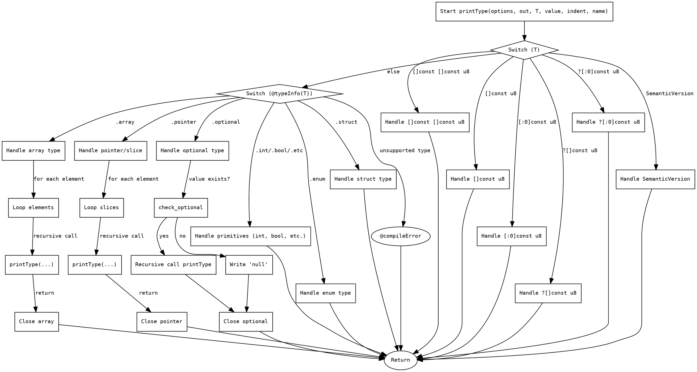

好的，我现在需要帮用户用Graphviz画出一个Zig函数的流程图。首先，我得仔细看看用户提供的代码，理解这个函数的结构和逻辑。

这个函数叫做printType，参数包括options、out、T、value、indent和name。看起来它的作用是根据不同的类型T，生成对应的Zig代码字符串，并写入到out中。函数里用了很多switch语句来处理不同的类型情况，比如切片、数组、指针、可选类型、结构体等等。

首先，我应该理清函数的主要分支结构。函数开始时有一个switch(T)语句，处理特定的类型，比如[]const []const u8、[]const u8等等。每个case里面有不同的处理逻辑，比如写入pub const声明，循环处理元素等。如果T不匹配这些具体类型，就会进入另一个switch(@typeInfo(T))，根据类型的信息进一步处理，比如数组、指针、可选类型、枚举、结构体等。如果所有情况都不匹配，最后会抛出编译错误。

接下来，我需要将这些逻辑分支转化为流程图的结构。流程图通常从开始节点开始，然后根据不同的条件分支展开。每个条件分支对应不同的处理步骤，最后可能会有合并或结束节点。

需要注意的是，函数中有多个嵌套的switch语句和循环结构，比如处理数组时的for循环。这些都需要在流程图中体现出来。此外，函数中的某些case会直接return，而另一些则会继续执行后续的代码，这可能会影响流程图的连接方式。

可能的步骤分解：
1. 开始节点：函数入口。
2. 第一个switch(T)，处理各个具体类型。
   - 每个case处理完后直接返回或继续。
3. 如果第一个switch没有匹配，进入第二个switch(@typeInfo(T))。
   - 处理类型信息，如数组、指针、可选类型等。
4. 每个分支内部可能有循环（如for处理数组元素）或进一步的条件判断。
5. 结束节点：函数返回。

需要特别注意递归调用的情况，例如在处理数组或结构体时，可能会递归调用printType函数。这在流程图中可能需要表示为子流程或单独的节点。

另外，错误处理部分（如@compileError）也需要在流程图中体现，可能作为终止节点。

现在，我需要将上述分析转化为Graphviz的DOT语言结构。每个判断节点用菱形表示，处理步骤用矩形，箭头表示流程方向。对于循环结构，可以用循环开始和结束的节点，或者用注释说明。

可能的挑战是如何简洁地表示复杂的嵌套结构，尤其是递归调用和多个switch语句。可能需要将主要的条件分支作为顶层节点，然后展开每个分支的内部步骤，同时保持图的可读性。

最后，生成DOT代码后，需要验证是否符合用户提供的函数逻辑，确保没有遗漏重要的分支或步骤。
================================================

该流程图通过以下方式表示函数逻辑：
1. 从入口点开始处理不同类型
2. 第一个switch(T)处理具体类型，直接返回
3. 未匹配时进入类型信息分析
4. 处理数组、指针时包含循环和递归调用
5. 处理可选类型时包含条件分支
6. 最终处理原始类型或抛出编译错误
7. 所有路径最终汇聚到返回节点

使用工具如Graphviz或在线渲染器（https://dreampuf.github.io/GraphvizOnline）可将其可视化为流程图。