嗯，我需要为这个Zig函数绘制流程图。首先，我得仔细看看这个函数的结构。函数名是printType，接收多个参数，包括选项、输出流、类型T、值、缩进和名称。看起来它的作用是根据不同的类型生成相应的Zig代码。

首先，函数开始有一个switch语句，针对不同的类型T进行处理。比如处理字符串切片、可选字符串、版本结构体等等。每个case里都有不同的处理逻辑，比如输出pub const声明或者数组结构。

接下来，如果类型没有在初始的switch中被匹配到，会使用@typeInfo来获取类型信息，再次进行分支处理，比如数组、指针、可选类型、基本类型、枚举、结构体等。每个分支处理不同的数据结构，递归调用printType或者其他的辅助函数如printEnum、printStruct。

我需要画出整个函数的流程。流程图的开始是进入printType函数。然后分为两个主要部分：第一个switch检查具体类型，第二个根据类型信息进行分支。

可能的流程分支包括：

1. 处理[]const []const u8类型：输出数组声明，遍历元素。
2. 处理普通字符串和以0结尾的字符串。
3. 处理可选字符串类型，判断是否为null。
4. 处理语义版本结构体，输出各个字段。
5. 其他类型进入第二个switch，处理数组、指针、可选类型、基本类型等。
6. 对于结构体或枚举类型，调用对应的printStruct或printEnum函数。

需要注意递归的情况，比如处理数组或指针时，每个元素会再次调用printType。还有处理结构体时可能涉及到结构体内部的各个字段。

需要确保每个分支都正确连接，并处理可能的缩进和输出格式。此外，函数中有一些编译时错误处理，比如非slice指针会触发编译错误，这些也应该在流程图中体现。

可能的结构是：

开始 -> 检查T的类型 -> 各个case处理 -> 如果没有匹配，进入@typeInfo分支 -> 处理不同的类型信息 -> 结束。

对于每个case，需要画出具体的处理步骤，比如循环元素、条件判断是否有名称等。同时，注意返回点和错误处理。

最后，需要确保流程图符合graphviz的语法，使用正确的节点和箭头连接，避免使用mermaid的语法。
================================================

```dot
digraph flowchart {
    node [shape=rectangle, style=rounded, fontname=Helvetica]
    edge [fontname=Helvetica]

    start [label="Start printType"]
    switch_T [label="Switch (T)"]
    case_array_of_slices [label="Case: []const []const u8"]
    handle_array_of_slices [label="Output array declaration\nLoop through elements\nFormat each slice"]
    case_slice [label="Case: []const u8"]
    handle_slice [label="Output string constant\nCheck name presence"]
    case_nullable_slice [label="Case: ?[]const u8"]
    handle_nullable_slice [label="Check null\nOutput null or value"]
    case_semver [label="Case: SemanticVersion"]
    handle_semver [label="Output struct fields\n.major, .minor, .patch\nHandle pre/build metadata"]
    typeinfo_switch [label="@typeInfo(T) Switch"]
    array_type [label="Array type\nOutput array syntax\nRecurse for elements"]
    pointer_type [label="Pointer (slice)\nOutput slice syntax\nRecurse for elements"]
    optional_type [label="Optional type\nCheck value presence\nRecurse for inner type"]
    basic_types [label="Basic types (int, bool, etc.)\nDirect value output"]
    enum_type [label="Enum type\nCall printEnum\nOutput enum tag"]
    struct_type [label="Struct type\nCall printStruct\nOutput struct fields"]
    error_case [label="Unsupported type\nTrigger compile error"]
    end [label="Return"]

    start -> switch_T
    switch_T -> case_array_of_slices [label="匹配"]
    case_array_of_slices -> handle_array_of_slices -> end

    switch_T -> case_slice [label="匹配"]
    case_slice -> handle_slice -> end

    switch_T -> case_nullable_slice [label="匹配"]
    case_nullable_slice -> handle_nullable_slice -> end

    switch_T -> case_semver [label="匹配"]
    case_semver -> handle_semver -> end

    switch_T -> typeinfo_switch [label="未匹配"]
    typeinfo_switch -> array_type [label=".array"]
    array_type -> array_type [label="Recurse for each element"]

    typeinfo_switch -> pointer_type [label=".pointer"]
    pointer_type -> pointer_type [label="Recurse for each element"]

    typeinfo_switch -> optional_type [label=".optional"]
    optional_type -> optional_type [label="Recurse if value present"]

    typeinfo_switch -> basic_types [label=".int/.bool/.float etc."]
    basic_types -> end

    typeinfo_switch -> enum_type [label=".enum"]
    enum_type -> end

    typeinfo_switch -> struct_type [label=".struct"]
    struct_type -> end

    typeinfo_switch -> error_case [label="其他未支持类型"]
    error_case -> end [label="终止编译"]
}
```
