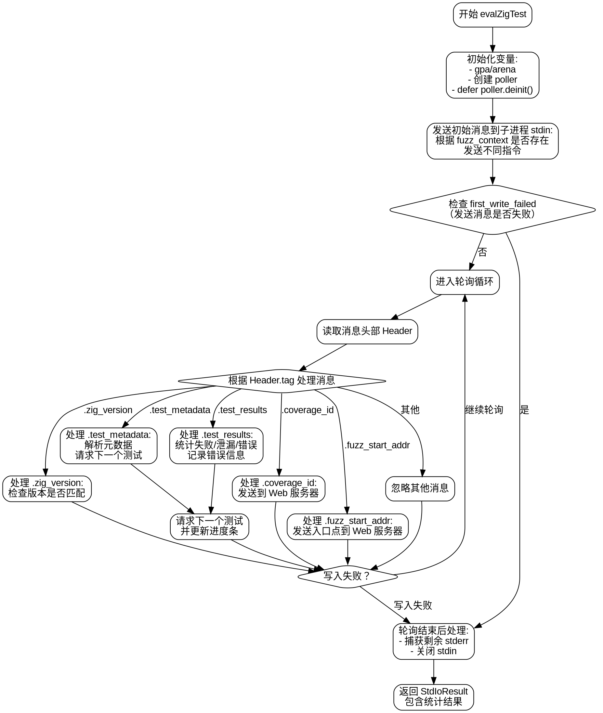

嗯，我现在需要画这个函数的流程图。首先，我得仔细读这段代码，理解它的逻辑结构。这个函数是evalZigTest，看起来是处理子进程的输出，收集测试结果，处理错误什么的。

首先，函数开始声明了一些变量，比如gpa和arena，都是分配器。然后创建了一个poller，用来监控子进程的stdout和stderr。之后有一个defer poller.deinit()，确保poller会被正确释放。接下来有一个条件判断first_write_failed，根据是否有fuzz_context来发送不同的消息到子进程的stdin。如果发送失败，会记录错误，并设置first_write_failed为true。

接下来是处理消息的循环。这里会不断轮询poller，读取头部信息，然后根据不同的消息类型进行处理。比如处理.zig_version，检查版本是否匹配；处理.test_metadata，获取测试的元数据；处理.test_results，统计失败、跳过、泄漏等数量，并记录错误信息。还有处理.coverage_id和.fuzz_start_addr的情况，发送消息到web服务器。

在循环过程中，如果有任何写入失败，会设置any_write_failed为true。循环结束后，如果any_write_failed，会继续轮询poller直到没有数据，确保捕获所有stderr输出。然后关闭stdin，返回结果。

接下来，我需要把这些步骤转化为流程图。流程图应该包括开始、各个条件判断、循环处理消息、不同的消息类型处理分支，以及最后的清理和返回结果。

需要注意的是，函数中有多个可能的错误路径，比如发送消息失败，或者版本不匹配导致直接返回错误。同时，循环处理消息的部分需要画出各个消息类型的处理分支，以及可能的错误处理。

可能的结构：

1. 开始
2. 初始化变量和poller
3. 发送初始消息（根据是否有fuzz_context）
4. 进入轮询循环
   a. 读取头部信息
   b. 根据消息类型处理不同的情况
   c. 处理可能的错误
5. 循环结束后处理可能的剩余stderr
6. 关闭stdin
7. 返回结果

在画图的时候，需要用条件判断节点、循环节点、处理分支等。比如，判断是否有fuzz_context，发送不同消息，处理不同的消息类型，统计结果，错误处理等。

可能忽略了一些细节，比如具体的数据处理步骤，但流程图主要关注控制流。需要确保每个条件分支和循环都被正确表示，以及错误处理的路径。
================================================
