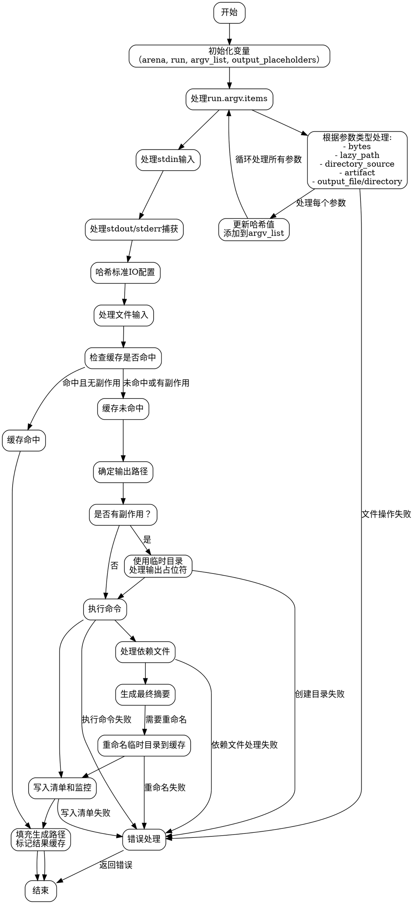

好的，我现在需要为这个Zig函数生成一个流程图。首先，我需要理解这个函数的结构和逻辑流程。函数名为`make`，看起来是处理构建步骤的，特别是运行某个命令的过程。

首先，我会通读整个函数，理清各个步骤。函数开始初始化一些变量，比如`argv_list`和`output_placeholders`，然后处理不同的参数类型，比如`bytes`、`lazy_path`、`artifact`等。每种参数类型都会被添加到`argv_list`中，并更新哈希值。

接下来，处理标准输入、输出和错误捕获的情况，这可能会影响缓存判断。然后检查是否有缓存命中，如果命中则跳过运行命令，直接使用缓存的结果。如果没有缓存命中，或者需要执行命令，就会进入运行命令的分支。

运行命令的部分分为两种情况：已知输出路径和未知输出路径。已知的情况下直接使用缓存目录，未知的情况下会生成临时目录，并在执行后重命名到最终位置。处理过程中还涉及到路径的创建、依赖文件的管理，以及可能的错误处理。

我需要将这些逻辑步骤转化为流程图。流程图应包括开始、各个条件判断（比如参数类型、缓存是否命中、是否有副作用等）、处理不同情况的子流程、错误处理以及结束点。

需要注意的是，函数中有多个循环（如处理`run.argv.items`和`output_placeholders`），这些需要在流程图中用循环结构表示。同时，条件分支如`switch`语句和`if`条件需要正确的分支路径。

可能的错误点比如文件操作失败（如`makePath`或`rename`失败）需要作为错误处理分支。此外，缓存命中和未命中的不同处理流程也要明确区分。

最后，流程图的结构要清晰，每个节点和分支要正确反映代码的执行顺序和逻辑关系。确保不遗漏任何关键步骤，如哈希计算、文件处理、命令执行和结果缓存。
================================================
