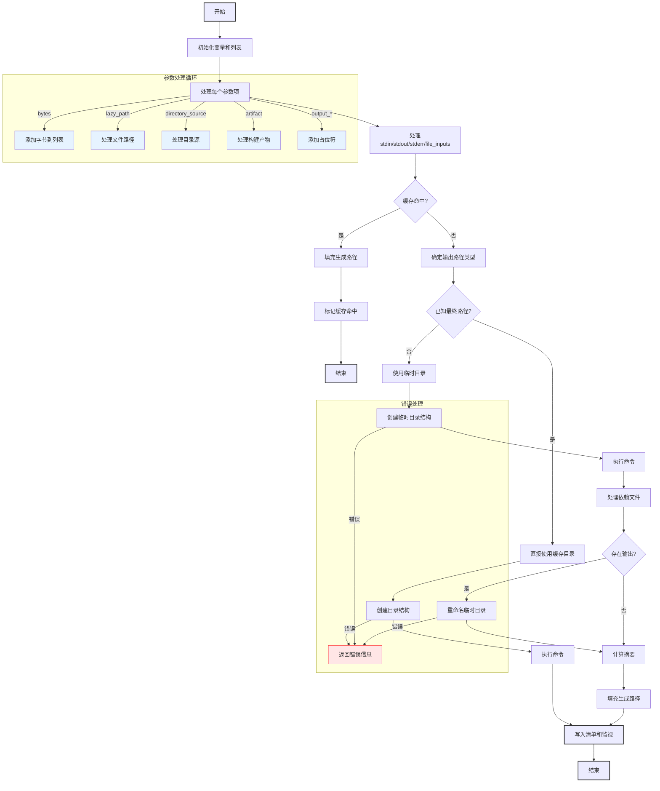

嗯，我需要为这个Zig函数绘制一个流程图。首先，我得理解这个函数的结构和逻辑。函数名是make，参数是一个Step指针和Step.MakeOptions。看起来是处理构建步骤的，特别是运行某个命令。

首先，函数开始时初始化了一些变量，比如prog_node、b、arena、run等。然后创建了argv_list和output_placeholders这两个动态数组。接下来，获取了一个缓存管理器man，并在函数结束时释放它。

然后是一个循环处理run.argv.items中的每个参数。根据参数的不同类型（bytes、lazy_path、directory_source、artifact、output_file/directory），分别处理，添加到argv_list，并更新哈希。这里可能有多个分支，需要分别表示。

之后处理标准输入（stdin）、捕获的标准输出和标准错误，以及文件输入。这些都是通过更新哈希或添加文件到缓存管理器来处理的。

接下来检查是否有副作用（has_side_effects）以及缓存是否命中。如果命中，则填充生成的路径并返回，跳过运行命令。这部分是一个条件判断，导致不同的流程分支。

如果缓存未命中，或者有副作用，继续处理输出路径。这里分为两种情况：已知最终输出路径（dep_output_file不存在）和未知（需要使用临时路径）。前者直接使用缓存目录，后者创建临时目录，并在命令运行后重命名到正式目录。

在处理输出路径时，可能需要创建目录，处理错误。然后调用runCommand执行命令。之后处理依赖文件，计算摘要（digest），并根据是否有输出进行重命名操作。

最后，无论哪种情况，都会填充生成的路径，并可能写入清单和监视文件。

绘制流程图时，需要将这些步骤分解成不同的节点，并用箭头连接条件分支。比如处理每个参数类型的循环、缓存命中检查、两种输出路径处理方式、错误处理等。同时需要注意函数中的错误处理部分，如makePath失败时的错误返回。

可能的结构是：

1. 初始化变量和列表
2. 处理每个参数（循环）
3. 处理stdin、stdout/stderr、文件输入
4. 检查缓存命中
   - 是：填充路径，返回
   - 否：继续执行
5. 确定输出路径方式（已知或临时）
6. 创建目录，处理错误
7. 执行命令
8. 处理依赖文件和摘要
9. 重命名临时目录（如果需要）
10. 填充生成的路径
11. 写入清单和监视

需要将这些步骤用条件判断连接，尤其是缓存检查和路径处理的分支。可能使用菱形表示条件判断，矩形表示操作步骤，箭头指示流程方向。同时，错误处理部分需要单独的分支，可能终止流程并返回错误。
================================================
