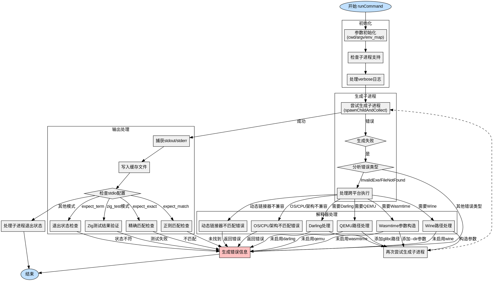

嗯，用户让我用Graphviz画一个Zig函数的流程图。首先，我需要理解这个函数的逻辑结构。这个函数叫runCommand，看起来是处理运行命令的步骤，包括生成子进程、处理输出、错误处理等等。

首先，我应该先通读整个函数，看看有哪些主要的分支和循环。函数开始的时候有一些参数检查，然后处理不同的运行模式，比如检查、测试等。接着，当生成子进程失败时，会进入错误处理，尝试使用解释器（如QEMU、Wine等）来运行命令。这里有很多条件判断，比如根据不同的错误类型选择不同的解释器。

然后，函数处理输出结果，包括标准输出和错误输出的捕获，最后根据不同的配置检查输出是否符合预期。如果不符合，就会生成错误信息。

接下来，我需要确定流程图的主要节点和分支。可能的节点包括：

1. 函数入口
2. 参数检查和初始化
3. 尝试生成子进程
4. 处理生成失败的情况，尝试使用解释器
5. 不同解释器的处理分支（QEMU、Wine、Darling、Wasmtime等）
6. 处理动态链接库路径（特别是Windows）
7. 捕获输出并写入文件
8. 检查输出是否符合预期（标准输出、错误输出、退出状态）
9. 错误处理和结果反馈

需要注意的是，每个条件判断（如switch语句）都会产生分支。例如，处理不同的stdio配置（check、zig_test等），每个配置下又有不同的检查项，如expect_stderr_exact、expect_stdout_match等，这些都需要在流程图中体现。

另外，错误处理部分有很多可能的失败点，每个失败点需要连接到相应的错误处理节点。例如，生成子进程失败时，根据错误类型进入不同的处理逻辑，如果无法使用解释器，则返回错误。

在绘制流程图时，需要注意节点之间的连接关系，使用条件判断框（菱形）来表示分支，矩形框表示处理步骤，椭圆形表示开始和结束。同时，要确保所有可能的执行路径都被覆盖，包括异常流程。

可能遇到的挑战是如何将复杂的逻辑结构简化为清晰的图形表示，避免过于复杂。可能需要将某些重复的部分抽象成子流程，或者使用分组来组织相关步骤。

最后，确保生成的Graphviz代码结构清晰，节点和边正确反映函数的执行流程。可能需要多次调整布局，使得流程图易于理解。
================================================

这个流程图通过以下方式组织逻辑：

1. 初始化阶段处理参数和日志
2. 主生成过程包含错误处理和跨平台执行逻辑
3. 解释器分支处理不同跨平台方案
4. 输出处理阶段包含多种验证方式
5. 错误处理贯穿整个流程，用红色节点突出显示
6. 使用子图分组保持层次清晰
7. 菱形节点表示条件判断
8. 虚线表示重试逻辑的循环

可以通过Graphviz工具（如dot命令）生成图片，建议使用层级布局算法（TB方向）保证可读性。主要复杂逻辑集中在解释器选择和输出验证部分，使用颜色区分正常流程和错误路径。