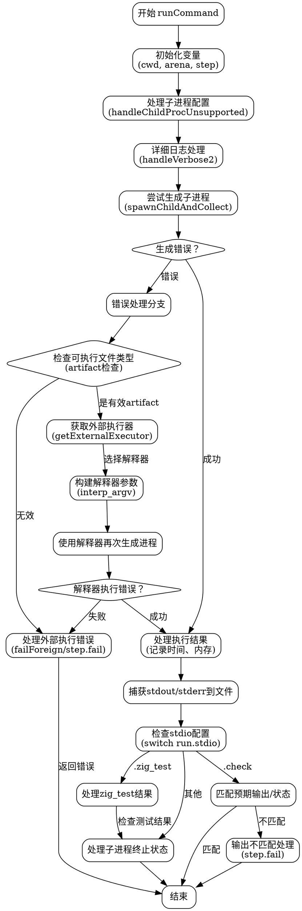

嗯，用户让我用Graphviz来画这个Zig函数的流程图。首先，我需要理解这个函数的结构。这个函数叫做runCommand，看起来是用来执行某个命令并处理结果的。函数参数有点多，包括运行配置、参数数组、是否有副作用、输出目录路径、进度节点和模糊测试上下文。

首先，流程图应该从函数的入口开始，也就是runCommand这个函数。然后，函数内部有几个主要的步骤。比如，设置cwd（当前工作目录），处理子进程的生成，检查错误，处理不同的外部执行器（比如QEMU、Wine、Darling等），捕获输出，处理测试结果等等。

我需要分解这个函数的逻辑流程。比如，首先初始化一些变量，然后尝试生成子进程。如果生成失败，可能会进入错误处理，检查是否是InvalidExe或者FileNotFound，这时候会尝试使用解释器（比如QEMU）来执行。这部分有多个分支，比如不同的外部执行器，每个执行器有不同的处理逻辑。

接下来，如果生成子进程成功，或者通过解释器执行成功，就会处理结果，比如记录执行时间、峰值内存使用，处理测试结果，捕获标准输出和错误输出，最后根据配置检查预期结果是否符合，比如检查stdout/stderr是否匹配预期，或者进程退出状态是否正确。

需要注意的是，函数中有多个可能的错误处理路径，比如生成子进程失败、解释器执行失败、文件写入失败等。这些都需要在流程图中体现出来。

另外，用户特别提到不要使用Mermaid，而是用Graphviz，所以需要确保生成的图是Graphviz的DOT语言格式。Graphviz的流程图通常用节点和边来表示，节点表示步骤，边表示流程走向。可能需要使用子图来分组不同的处理部分，比如错误处理、解释器选择、输出处理等。

在画图的时候，需要注意条件判断的分支，比如if语句、switch语句，以及循环结构（虽然这个函数里看起来没有明显的循环）。每个条件判断会产生两个或多个分支，比如处理不同的外部执行器类型（QEMU、Wine等），每个分支有不同的操作步骤。

可能还需要处理函数中的递归调用，比如spawnChildAndCollect可能被调用多次，但在这个上下文中，可能需要将其视为一个步骤，而不是展开内部细节。

最后，需要确保流程图的连贯性，每个步骤之间的转换清晰，错误处理路径正确连接到相应的处理节点，并且整个图的结构合理，不会过于复杂难以理解。

总结一下，步骤大致如下：
1. 函数入口。
2. 初始化变量（cwd，处理参数）。
3. 尝试生成子进程。
4. 如果失败，检查错误类型，进入解释器处理逻辑。
   a. 根据不同的外部执行器类型，构建不同的命令行参数。
   b. 再次尝试生成子进程。
   c. 如果再次失败，处理错误。
5. 处理子进程结果，记录时间和内存。
6. 处理测试结果，检查预期输出。
7. 捕获stdout/stderr到文件。
8. 根据配置检查输出是否符合预期，处理不符合的情况。
9. 函数结束或错误退出。

在绘制流程图时，每个主要步骤作为一个节点，条件判断作为分支节点，错误处理作为单独的分支。可能需要将解释器处理部分作为一个子图，包含不同的执行器选择和处理逻辑。同时，处理输出和检查预期的部分也需要详细展开。
================================================

该流程图使用Graphviz的DOT语言绘制，重点描述以下逻辑：
1. 初始化阶段和子进程生成尝试
2. 错误处理分支（包括外部解释器选择逻辑）
3. 结果处理阶段（输出捕获和校验）
4. 多级错误处理路径
5. 不同stdio配置的分支处理

图中菱形节点表示条件判断，矩形节点表示操作步骤，箭头方向表示程序执行流向。对于复杂的外部解释器选择逻辑（QEMU/Wine/Darling等）进行了抽象，实际实现中每个解释器类型会有独立的参数构建逻辑。