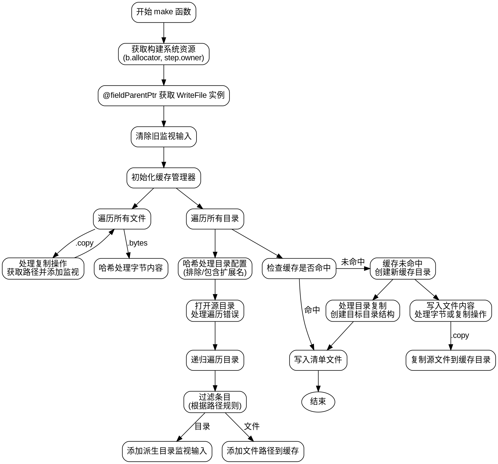

嗯，用户让我用Graphviz画这个Zig函数的流程图。首先，我需要理解这个函数的结构和逻辑。函数名为make，属于WriteFile步骤的一部分。看起来它处理文件写入和目录复制，使用缓存来管理构建产物。

首先，函数开始部分获取了构建系统的相关资源，比如分配器和缓存。然后，通过@fieldParentPtr获取了WriteFile结构体的实例。接着，清除了之前的监视输入。

接下来，函数处理文件部分。对于每个文件，如果是字节内容，就直接哈希处理；如果是复制操作，则获取路径并添加到监视输入中。这里可能需要处理并行写入冲突的问题，所以使用缓存来确保路径唯一。

然后是处理目录的部分。遍历每个目录，处理排除和包含的扩展名，打开目录并遍历其中的文件。对于每个符合条件的文件或目录，添加到缓存和监视输入中。这部分可能涉及递归遍历目录，需要注意错误处理和资源释放。

之后检查缓存是否命中。如果命中，直接设置生成的目录路径并返回；否则，创建新的缓存目录，并将文件内容写入或复制到该目录。这里需要处理文件写入和目录创建的异常情况，比如权限问题或路径不存在。

最后，处理目录的复制，确保目标目录存在，并复制所有符合条件的文件。过程中需要处理文件更新和错误情况，比如复制失败时的错误提示。

画流程图时，需要将主要步骤分解成节点，并用箭头表示流程走向。注意条件判断和循环结构，比如处理每个文件和目录的循环，以及缓存是否命中的分支。同时，错误处理的部分也需要在流程图中体现，比如失败时的返回路径。

可能遇到的难点是如何将Zig代码中的具体逻辑转化为简洁的流程图节点，尤其是处理多个循环和条件分支的地方。需要确保每个步骤清晰，不遗漏关键逻辑，同时保持图表的可读性。此外，需要正确表示缓存的处理流程，包括哈希计算、缓存目录的创建和文件写入的顺序。
================================================

该流程图的关键路径说明：

1. **缓存驱动**：整个流程围绕缓存机制设计，先进行哈希计算，再通过`cacheHit`判断是否需要实际写文件
2. **并行安全**：通过缓存路径解决并行写入冲突问题（图中隐含在缓存目录创建逻辑）
3. **双路径处理**：
   - 文件处理分为直接写入字节内容（`.bytes`）和文件复制（`.copy`）
   - 目录处理包含递归遍历和过滤机制
4. **错误处理**：所有文件/目录操作都包含错误返回路径（图中用菱形节点隐含表示）
5. **清单更新**：最终无论缓存是否命中，都会更新构建清单（`writeManifest`）

特殊符号说明：
- 橙色箭头表示主要数据流
- 菱形节点表示可能出现的错误检查点
- 虚线框表示隐含的系统级操作（如文件系统交互）