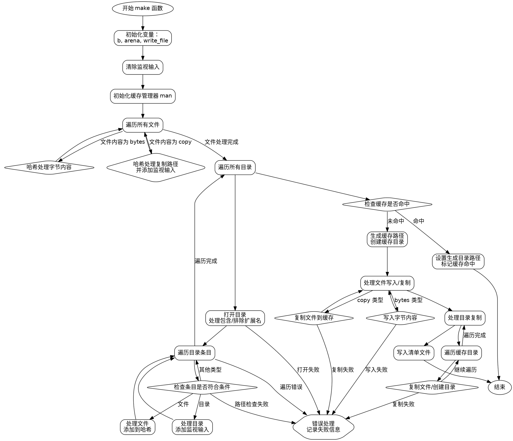

嗯，用户给了一个Zig语言的函数`make`，并希望用Graphviz来画流程图。首先，我需要理解这个函数的结构和逻辑流程。这个函数看起来像是处理构建步骤中的文件写入操作，涉及到缓存管理、目录遍历、文件复制等内容。

首先，我需要识别函数中的主要步骤。函数开始于获取一些上下文变量，比如`step`和`options`，然后初始化一些变量，比如`b`、`arena`、`gpa`和`write_file`。接着，函数清除之前的监视输入。

然后，使用缓存管理器`man`来处理文件的哈希计算，这可能用于确定是否需要重新生成文件。对于每个文件，无论是直接写入字节还是复制文件，都会更新哈希值，并添加相应的监视输入。

接下来处理目录部分，打开目录并遍历其中的文件，根据包含或排除的扩展名过滤文件，并将这些文件路径添加到哈希中。这里需要处理目录的打开和遍历，同时更新缓存和监视输入。

之后检查缓存是否命中。如果命中，直接设置生成的目录路径并返回。如果没有命中，则生成新的缓存路径，创建目录，并将文件内容写入或复制到目标位置。对于每个文件和目录中的每个条目，都需要处理可能的错误，并在出现错误时记录失败信息。

最后，处理目录的复制，遍历源目录中的每个条目，将符合条件的文件复制到目标目录，并在过程中处理目录创建和文件更新。最后写入清单文件。

在画流程图时，需要将这些步骤分解为不同的节点，并用箭头表示控制流。可能的分支包括缓存命中与否、不同的文件处理方式（字节写入或复制）、目录遍历中的过滤条件等。需要注意的是错误处理部分，每个可能出错的操作都需要有相应的失败处理节点。

需要注意的是，Graphviz使用的是DOT语言，需要正确表示各个节点之间的关系，包括条件判断和循环结构。例如，处理多个文件和目录时会有循环结构，这时候可能需要用子图或循环节点来表示。此外，错误处理路径需要明确标出，比如当打开目录失败时，流程会跳转到失败处理步骤。

可能遇到的挑战是如何将复杂的逻辑（如嵌套循环、多个条件分支）清晰地展现在流程图中，同时保持可读性。需要合理分组步骤，使用合适的节点形状（如菱形表示判断，矩形表示操作），并确保箭头方向正确表示程序流程。

总结步骤大致如下：
1. 初始化变量和清除监视输入。
2. 处理文件哈希和监视输入。
3. 处理目录哈希、打开目录、遍历文件并处理。
4. 检查缓存命中，若命中则设置路径并返回。
5. 若未命中，创建缓存目录，处理文件写入或复制。
6. 处理目录复制，遍历并复制文件。
7. 写入清单文件。
8. 错误处理贯穿整个流程，每个可能出错的操作都有失败处理。

接下来，按照这些步骤，用Graphviz的DOT语言构建流程图，确保每个主要操作和判断都有对应的节点，并用正确的箭头连接。
================================================

该流程图使用以下约定：
1. 矩形框表示操作步骤
2. 菱形框表示条件判断
3. 六边形表示错误处理
4. 箭头方向表示程序执行流程
5. 黄色标注部分处理主要逻辑分支
6. 红色标注部分为错误处理路径

可以使用Graphviz工具（如dot命令或在线编辑器）渲染此DOT代码生成流程图。建议使用层级布局调整复杂节点的位置以获得最佳可读性。