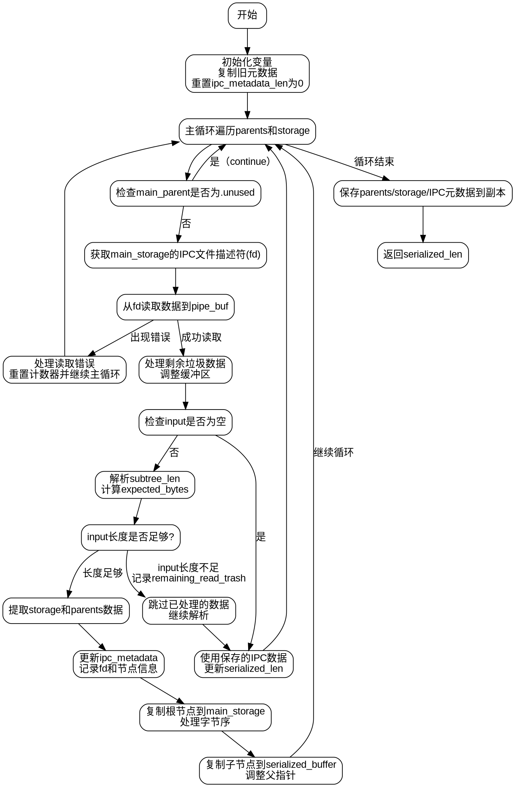

好，我现在需要为这个Zig函数`serializeIpc`画一个流程图。首先，我得先理解这个函数的功能和结构。函数名为`serializeIpc`，可能涉及进程间通信（IPC）的序列化处理。函数参数是`start_serialized_len`和一个指向`Serialized.Buffer`的指针，返回一个`usize`类型，可能是处理后的长度。

接下来，看函数内部。开始的部分定义了一些变量，比如`ipc_metadata_fds_copy`、`ipc_metadata_copy`等，这些可能是用来复制或保存IPC元数据的。然后初始化`serialized_len`为输入的起始长度，并声明了一个缓冲区`pipe_buf`，大小是2*4096字节，应该是用来临时存储读取的数据。

然后看到`old_ipc_metadata_fds`和`old_ipc_metadata`，可能是之前保存的元数据，之后将`ipc_metadata_len`重置为0。接着进入主循环`main_loop`，遍历`serialized_buffer.parents`和`storage`数组。这里检查`main_parent`是否为`.unused`，如果是就跳过。然后获取`fd`（文件描述符），如果不存在也跳过。

接下来是处理读取数据的部分。使用`posix.read`读取`fd`到`pipe_buf`，处理可能的错误，比如`WouldBlock`或其他错误，错误处理中重置计数并继续循环。如果有数据读取，处理可能的`remaining_read_trash_bytes`，这部分可能涉及跳过无效数据或者复制有效数据到缓冲区。

然后处理读取到的数据，检查是否有足够的字节，解析`subtree_len`，计算期望的字节数，如果不足则保存状态并继续循环。如果数据足够，提取`storage_bytes`和`parents_bytes`，转换为对应的结构切片。

之后更新`ipc_metadata`数组，记录fd和相关信息。复制根节点到主存储，处理字节序。接着将剩余节点复制到`serialized_buffer`的末尾，调整父节点指针，处理可能的越界情况，设置正确的父索引。

最后，保存当前的parents、storage和元数据到副本中，返回新的`serialized_len`。

现在需要将这些步骤转化为流程图。流程图通常包括开始、结束、处理步骤、判断、循环等元素。需要注意循环结构，特别是主循环`main_loop`，以及内部的while循环读取数据。错误处理的分支也需要考虑进去。

可能的步骤分解：

1. 初始化变量，复制旧元数据。
2. 进入主循环，遍历每个父节点和存储。
3. 检查父节点是否有效，获取文件描述符。
4. 读取数据到缓冲区，处理错误或阻塞。
5. 处理已读取的数据，包括可能的垃圾数据。
6. 解析数据，检查长度是否足够。
7. 更新元数据，复制节点数据，调整父指针。
8. 继续循环直到所有节点处理完毕。
9. 保存副本数据，返回新的长度。

需要注意条件判断，如`if (main_parent == .unused) continue;`，`if (opt_saved_metadata)`，以及数据长度是否足够的判断。循环结构可能需要用流程图的循环节点表示，例如主循环和内部的while循环。

另外，处理字节序的部分可能需要单独步骤，比如`if (is_big_endian)`的条件分支。还有处理父节点指针的部分，涉及到不同的情况判断，如是否是根节点，是否越界等。

最后，流程图的结束点是保存副本数据并返回长度。需要确保所有可能的路径都覆盖，包括错误处理路径。
================================================
