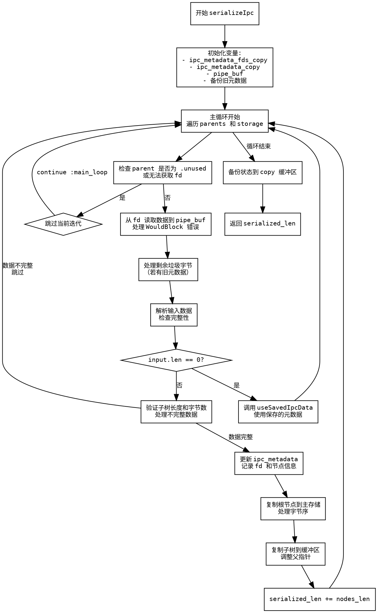

好的，我现在需要为提供的Zig函数`serializeIpc`绘制流程图。首先，我应该仔细阅读代码，理解它的结构和逻辑流程，然后将其转化为图形化的表示。

首先，函数`serializeIpc`的参数是`start_serialized_len`和一个指向`Serialized.Buffer`的指针。函数返回一个`usize`。看起来这个函数处理IPC（进程间通信）的数据序列化，可能涉及到读取管道中的数据，处理元数据，并将数据复制到缓冲区中。

接下来，代码开始初始化一些变量，比如`ipc_metadata_fds_copy`、`ipc_metadata_copy`等，这些似乎是对原始缓冲区的引用或拷贝。然后定义了一个固定大小的缓冲区`pipe_buf`，可能是用于临时存储从管道读取的数据。

然后，代码进入一个主循环`main_loop`，遍历`serialized_buffer.parents`和`serialized_buffer.storage`。循环中的每个迭代处理一个父节点和对应的存储数据。如果父节点未被使用，或者无法获取文件描述符`fd`，则跳过当前迭代。

接下来，尝试从管道中读取数据到`pipe_buf`。这里有一个错误处理，如果读取失败（比如`WouldBlock`错误），则继续处理下一个循环。读取过程中，如果有旧的元数据存在，会处理剩余需要忽略的字节。

处理完读取的数据后，检查输入的长度。如果输入为空，则调用`useSavedIpcData`函数，使用保存的元数据。否则，解析输入数据，提取`storage`和`parents`的信息。这里有一些条件判断，确保数据的完整性和正确性，比如检查预期的字节数是否足够，处理多余的数据等。

然后，更新元数据信息，将当前的文件描述符和处理后的数据位置记录到`ipc_metadata_fds`和`ipc_metadata`数组中。接着，复制根节点到主存储，并根据字节序进行必要的交换。

之后，将子树的其余部分复制到序列化缓冲区的末尾，并调整父指针，确保它们指向正确的位置。这涉及到遍历父节点数组，并根据子节点数据的位置调整索引。

最后，函数在返回之前，将当前的状态拷贝到备份缓冲区中，以便下次更新时使用。

在绘制流程图时，需要将这些步骤分解成不同的节点，并用箭头表示控制流。可能的节点包括：

1. 初始化变量和元数据。
2. 主循环开始，遍历父节点和存储。
3. 检查父节点是否有效，获取文件描述符。
4. 读取管道数据，处理错误和剩余字节。
5. 解析输入数据，处理子节点信息。
6. 更新元数据和复制数据到缓冲区。
7. 调整父指针和处理字节序。
8. 备份当前状态到拷贝缓冲区。

每个条件判断（如`if (n == 0)`、`if (input.len < expected_bytes)`等）都会产生分支，需要用菱形节点表示，并根据条件结果导向不同的处理路径。

需要注意的是，循环结构（如`main_loop`和内部的`while (true)`）需要正确表示循环的入口和出口。例如，`continue :main_loop`会跳回到主循环的开始，而`break`则退出当前循环。

可能遇到的挑战是如何处理复杂的嵌套循环和条件分支，确保流程图的逻辑清晰。另外，函数中使用的某些Zig特定语法（如错误处理`catch |err| switch (err)`）需要正确理解其控制流影响。

为了验证理解是否正确，可以尝试用简单的例子跟踪代码执行路径，确保每个条件分支和循环的行为符合预期。例如，当`posix.read`返回`error.WouldBlock`时，代码会跳出循环，继续处理下一个主循环迭代；而当读取成功但有剩余数据时，会如何处理等。

总结来说，流程图应该从函数入口开始，按照初始化、主循环处理、数据读取与解析、元数据更新、数据复制、状态备份的顺序展开，详细展示每个判断和循环的结构。
================================================
以下是使用Graphviz绘制的`serializeIpc`函数流程图：

### 流程图说明：
1. **初始化变量**：加载元数据副本并初始化缓冲区。
2. **主循环**：遍历所有父节点和存储数据。
3. **有效性检查**：跳过无效的父节点或无法获取文件描述符的情况。
4. **读取管道**：从文件描述符读取数据，处理错误和剩余字节。
5. **解析数据**：验证数据完整性，处理不完整或多余的数据。
6. **元数据更新**：记录当前处理的文件描述符和子树信息。
7. **数据复制**：将根节点和子树数据复制到缓冲区，调整父指针。
8. **状态备份**：循环结束后备份当前状态到副本缓冲区。
9. **返回结果**：返回最终的序列化长度。

流程图中菱形节点表示条件分支，矩形节点表示操作步骤，箭头表示控制流方向。