好的，我现在需要根据提供的Zig代码绘制函数的流程图。首先，我要理解这个函数的结构和逻辑。函数名为cTypeBitSize，接受Target和CType参数，返回u16。看起来这个函数的作用是根据不同的目标操作系统、CPU架构和ABI来确定不同C类型的大小（以位为单位）。

首先，函数的结构主要是通过多个switch语句分层处理不同的情况。最外层的switch根据target.os.tag的值分成了几个大的分支，比如.freestanding和.other，然后是其他操作系统如.windows、.uefi，以及各种BSD系统、macOS等。每个大的分支内部又根据target.cpu.arch进一步细分，接着是针对具体的c_type进行判断，确定返回的位数。

接下来，我需要将这些逻辑分支转化为流程图。流程图通常从开始节点开始，然后根据不同的条件分支展开。每个条件判断对应一个菱形节点，处理不同的情况，最终指向返回值的矩形节点。

可能的步骤：
1. 确定主流程的起点，即函数入口。
2. 第一层判断：根据target.os.tag的值分到不同的分支。
3. 每个分支内部分析对应的处理逻辑，例如在.freestanding或.other的情况下，进一步根据CPU架构处理。
4. 对于每个CPU架构，再根据c_type的不同类型返回不同的位数。
5. 处理完所有情况后，每个路径最终指向返回语句。

需要注意的是，代码中存在多层嵌套的switch语句，这可能导致流程图变得复杂。因此，需要合理组织层次结构，避免交叉和混乱。例如，可以将每个主要的os.tag分支作为主分支，然后在每个主分支下展开对应的cpu.arch处理，再进一步处理c_type。

另外，部分情况还有更细的条件判断，例如在x86_64架构下，根据ABI的不同，long和ulong的位数可能不同。这些也需要在流程图中体现出来。

可能的挑战是如何在不过于复杂的情况下清晰地展示所有重要的分支。可能需要将某些常见或相似的情况合并，或者使用子流程来处理重复的结构。

最终，流程图的结构可能大致如下：
- 开始
- 判断target.os.tag
  - 分支1：.freestanding, .other → 判断cpu.arch → 处理各c_type
  - 分支2：其他OS（如windows, uefi）→ 处理对应的cpu.arch和c_type
  - ... 其他OS分支
- 每个分支最终处理到具体的c_type并返回位数
- 结束

在绘制过程中，需要确保每个条件判断都有明确的出口，并且每个返回路径都被正确表示。如果某些条件有例外情况（例如特定ABI或OS的覆盖），也需要在流程图中标注出来。

可能还需要使用颜色或不同的形状来区分不同层次的判断，例如用菱形表示条件判断，矩形表示处理步骤，椭圆形表示开始/结束节点。这样可以提高流程图的可读性。

总结来说，绘制这个流程图需要仔细分析每个switch语句的结构，分层次展开，并合理组织节点和连接线，确保逻辑清晰，避免遗漏任何重要的条件分支。
================================================

```dot
digraph flowchart {
    node [shape=rectangle, fontname="Arial"];
    edge [fontname="Arial"];
    start [label="Start: cTypeBitSize(target, c_type)", shape=ellipse];
    end [label="End (return value)", shape=ellipse];

    // 第一层：操作系统判断
    os_tag [label="switch(target.os.tag)", shape=diamond];
    start -> os_tag;

    // 主要分支
    subgraph cluster_freestanding_other {
        label=".freestanding, .other";
        freestanding_other_cpu [label="switch(target.cpu.arch)", shape=diamond];
        msp430 [label=".msp430"];
        avr [label=".avr"];
        mips64 [label=".mips64, .mips64el"];
        x86_64 [label=".x86_64"];
        default_arch [label="else (default arch)"];

        freestanding_other_cpu -> msp430;
        freestanding_other_cpu -> avr;
        freestanding_other_cpu -> mips64;
        freestanding_other_cpu -> x86_64;
        freestanding_other_cpu -> default_arch;

        // 处理每个 CPU 架构的 c_type
        msp430 -> "switch(c_type) → return 8/16/32/64";
        avr -> "switch(c_type) → return 8/16/32/64";
        mips64 -> "switch(c_type) → return 8/16/32/64/128";
        x86_64 -> "switch(c_type) → return 8/16/32/64/80";
        default_arch -> "switch(c_type) → return 8/16/ptrBitWidth()/64/...";
    }

    subgraph cluster_windows_uefi {
        label=".windows, .uefi";
        windows_uefi_cpu [label="switch(target.cpu.arch)", shape=diamond];
        x86 [label=".x86"];
        x86_64_win [label=".x86_64"];
        default_arch_win [label="else"];

        windows_uefi_cpu -> x86;
        windows_uefi_cpu -> x86_64_win;
        windows_uefi_cpu -> default_arch_win;

        x86 -> "switch(c_type) → return 8/16/32/64/80";
        x86_64_win -> "switch(c_type) → return 8/16/32/64/80";
        default_arch_win -> "switch(c_type) → return 8/16/32/64";
    }

    subgraph cluster_other_oses {
        label="Other OS (Linux, BSD, macOS, etc.)";
        other_os_cpu [label="switch(target.cpu.arch)", shape=diamond];
        other_os_cpu -> "... (similar nested logic)";
    }

    // 连接主分支
    os_tag -> cluster_freestanding_other [label=".freestanding, .other"];
    os_tag -> cluster_windows_uefi [label=".windows, .uefi"];
    os_tag -> cluster_other_oses [label="Other OS tags"];

    // 统一指向结束节点
    "switch(c_type)..." -> end [style=dashed];
    "... (similar nested logic)" -> end [style=dashed];
}
```

### 流程图说明：
1. **入口**：函数从 `cTypeBitSize` 开始。
2. **第一层判断**：根据 `target.os.tag` 分为三个主分支：
   - `.freestanding, .other`
   - `.windows, .uefi`
   - 其他操作系统（如 Linux、macOS、BSD 等）。
3. **子分支**：
   - **CPU 架构判断**：每个主分支内部分析 `target.cpu.arch`（例如 `.x86_64`、`.msp430`）。
   - **C 类型处理**：根据 `c_type` 返回对应的位数（如 `.char → 8`、`.long → 64`）。
4. **特殊逻辑**：
   - 部分架构（如 `.x86_64`）会根据 `target.abi` 进一步细分。
   - `longdouble` 的大小依赖更多条件（如 `.powerpc` 的 ABI 或 OS 类型）。
5. **结束**：所有路径最终指向返回语句。

### 特点：
- 使用 **嵌套的子图** 表示不同操作系统的逻辑。
- **菱形节点** 表示条件判断（如 `switch` 语句）。
- **矩形节点** 表示具体操作（如返回数值）。
- **虚线箭头** 表示隐含的返回路径（实际绘制时需展开具体逻辑）。