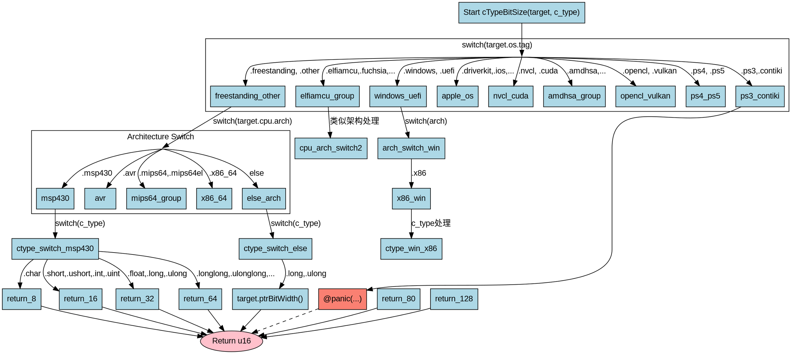

好的，我需要为提供的Zig函数`cTypeBitSize`绘制一个流程图。首先，我需要理解这个函数的结构和逻辑。

函数的主要逻辑是根据不同的操作系统（`target.os.tag`）、CPU架构（`target.cpu.arch`）、ABI（`target.abi`）以及C类型（`c_type`）来确定各个C类型所占的比特大小。函数通过多层的switch语句来处理这些不同的情况。

首先，函数最外层根据`target.os.tag`进行分支，比如`.freestanding`和`.other`，然后进入不同的操作系统分类，比如Windows、macOS、Linux等。每个操作系统分类下，又根据CPU架构进一步分支，例如x86、x86_64、ARM等。每个架构下再根据具体的C类型（如char、int、long等）进行判断，返回相应的比特大小。

接下来，我需要将这些嵌套的switch结构转化为流程图。流程图应该从顶层开始，根据不同的操作系统标签分支，然后逐步深入到CPU架构、ABI，最后到具体的C类型。每个条件判断对应一个决策节点，每个返回语句对应一个终止节点。

需要注意以下几点：
1. 由于代码中存在大量的嵌套switch，直接绘制所有分支可能导致流程图过于复杂。可能需要将某些常见或重复的结构合并或简化，以提高可读性。
2. 确保每个条件分支的路径清晰，特别是当多个条件组合影响结果时，如某些情况下需要同时考虑ABI和操作系统标签。
3. 对于重复的逻辑（例如多个操作系统分支下处理相同CPU架构的方式类似），可以考虑在流程图中用公共节点表示，避免重复绘制。

此外，需要确认是否所有可能的路径都有明确的返回，避免出现遗漏的情况。例如，代码末尾的`@panic`调用需要明确标注为错误处理节点。

最后，使用Graphviz的DOT语言来描述流程图，正确使用节点和边的定义，确保逻辑正确且布局合理。
================================================

这个Graphviz流程图：
1. 使用子图表示主要的操作系统分支
2. 用菱形节点表示switch决策
3. 用蓝色矩形表示处理步骤
4. 用粉色椭圆表示最终返回
5. 特殊错误路径用红色标注
6. 保持了代码中多层switch的嵌套逻辑结构
7. 对重复模式进行了抽象简化

可以通过Graphviz渲染工具生成矢量图，建议使用`dot -Tsvg`命令生成SVG格式以获得最佳可读性。