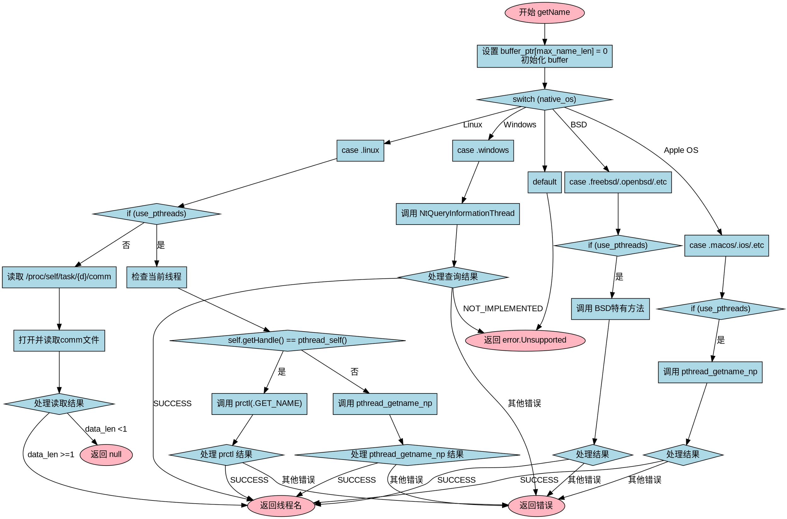

嗯，我需要为给定的Zig函数绘制一个流程图。首先，我得仔细阅读这段代码，理解它的结构和逻辑流程。

函数`getName`接受一个Thread对象和一个缓冲区指针，返回线程名称或错误。它根据不同的操作系统和条件使用不同的方法获取线程名。代码中有一个大的switch语句，根据`native_os`的不同分支处理不同平台的情况，比如Linux、Windows、macOS等。每个平台下可能还有条件判断，比如是否使用pthreads。

接下来，我需要确定如何将这段代码转化为流程图。流程图通常包括开始、结束、判断节点、处理步骤和箭头连接。每个条件分支（如switch case和if语句）都需要对应的判断节点，然后根据不同的条件走向不同的处理流程。

首先，函数开始于调用`getName`方法。然后设置buffer_ptr的最后一个字节为0，并初始化buffer。接下来是主switch语句，根据native_os选择不同的处理路径。每个操作系统分支内部可能还有进一步的判断，比如Linux下检查是否使用pthreads，然后处理当前线程或其他线程的情况。Windows部分调用NtQueryInformationThread，处理返回结果。其他如macOS、FreeBSD等也有各自的处理逻辑。最后，如果操作系统不被支持，返回error.Unsupported。

需要注意各个条件之间的连接，特别是错误处理和返回路径。例如，在Linux下，如果是当前线程，调用prctl获取名称；否则使用pthread_getname_np。每个可能的错误码需要处理，返回相应的错误或结果。

在绘制流程图时，可能需要为每个主要的条件分支创建判断节点，每个处理步骤作为过程节点，错误处理和返回作为终止节点。需要确保所有可能的执行路径都被覆盖，包括正常返回和错误返回的情况。

需要检查是否有遗漏的分支，例如在SerenityOS或其他操作系统中是否有未处理的情况。另外，注意在FreeBSD部分使用pthread_get_name_np而不是pthread_getname_np，这可能需要单独的分支处理。

最后，确保流程图的结构清晰，层次分明，每个节点和箭头正确反映代码的执行流程，避免交叉和混乱。
================================================
