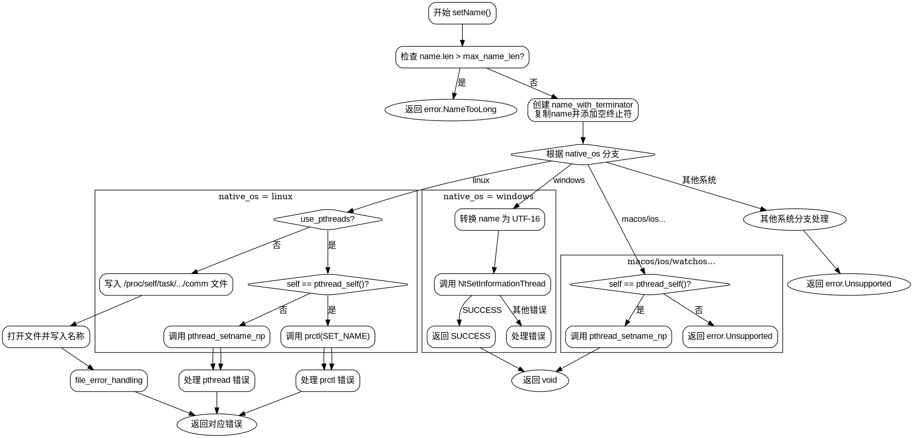

好的，我需要为给定的Zig函数`setName`绘制一个流程图。首先，我需要理解这个函数的结构和逻辑。

函数`setName`的主要功能是为线程设置名称。它处理不同操作系统下的不同实现方式，包括Linux、Windows、macOS等。首先检查名称长度是否超过最大限制，如果超过则返回错误。接着，添加终止符到名称末尾，确保字符串正确终止。然后根据不同的操作系统使用不同的系统调用来设置线程名称。

流程图的起点应该是函数入口，首先检查名称长度，如果过长则直接返回错误。然后创建带有终止符的名称缓冲区。接下来，根据不同的操作系统分支处理。每个操作系统分支可能有不同的处理逻辑，例如Linux下使用prctl或pthread_setname_np，Windows下使用NtSetInformationThread，macOS下只能设置当前线程名称等。每个分支处理完后可能返回成功或错误。

需要注意的条件包括：操作系统的判断（如native_os的不同值），是否使用pthreads（use_pthreads变量），以及当前线程是否是自身等。例如，在Linux下，如果线程是自身，则调用prctl，否则调用pthread_setname_np。而在macOS下，只能设置当前线程的名称，否则返回不支持错误。

此外，每个系统调用后都需要处理可能的错误，并根据错误码返回相应的错误类型。例如，在Windows部分，调用NtSetInformationThread后检查返回状态，处理成功、未实现或其他错误情况。

流程图需要清晰地展示这些判断分支和处理步骤，使用条件判断框来表示不同的操作系统和条件，处理框表示具体的系统调用，终止框表示返回结果或错误。需要确保所有可能的执行路径都被覆盖，包括错误处理和正常返回。

最后，确保流程图符合Graphviz的语法，使用正确的节点和箭头连接，避免使用Mermaid语法。
================================================
