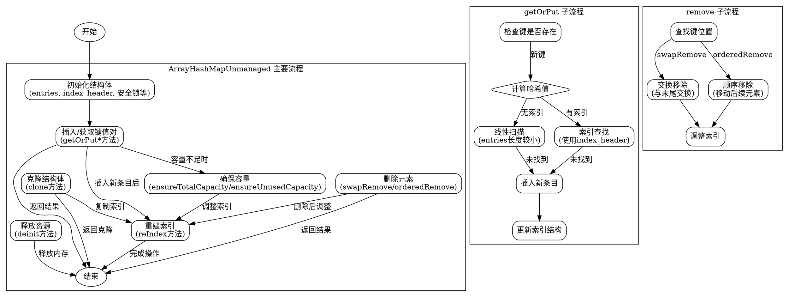

嗯，我需要为这个Zig语言中的ArrayHashMapUnmanaged函数绘制一个流程图。首先，我得理解这个函数的整体结构和工作原理。看起来这是一个泛型函数，用于创建和管理一个基于数组的哈希映射。参数包括键类型K，值类型V，上下文Context，以及是否存储哈希值的标志store_hash。返回的是一个结构体类型，包含了各种方法和状态。

首先，我应该先理清这个结构体的主要组成部分。结构体内部有entries，这是一个MultiArrayList，用来存储键值对及其哈希值。还有index_header，可能用于索引管理。然后有很多方法，比如初始化、插入、删除、查找等。每个方法都有不同的变体，比如带有Context参数的版本。

接下来，我需要确定流程图的范围。因为整个函数非常庞大，包含很多方法，可能需要分层绘制。比如，主流程可能包括初始化、插入元素、删除元素、查找元素等主要操作。每个主要操作下再细分步骤。

例如，插入元素的过程可能包括：
1. 检查是否需要扩容。
2. 计算键的哈希值。
3. 查找合适的槽位。
4. 处理哈希冲突（比如线性探测或链地址法）。
5. 更新索引。
6. 插入新的键值对到entries中。

删除元素的过程可能包括：
1. 查找要删除的键的位置。
2. 从entries中移除该元素。
3. 调整索引以保持正确性。
4. 处理可能的哈希冲突后的元素移动。

查找元素的过程可能包括：
1. 计算哈希值。
2. 根据索引查找可能的槽位。
3. 线性探测直到找到匹配的键或空槽。

此外，还需要考虑不同情况下的分支，比如是否存储哈希值，是否有现有的索引头，是否需要进行线性扫描等。

绘制流程图时，应该使用标准的图形符号，比如开始/结束用椭圆，操作用矩形，判断用菱形，箭头表示流程方向。每个主要函数或方法作为一个处理框，条件判断决定流程分支。

可能还需要考虑错误处理和内存管理部分，比如确保容量时的错误处理，内存分配失败时的回退机制等。

由于代码中有很多方法，可能需要为每个重要方法绘制子流程图，然后在主流程图中引用这些子流程。例如，getOrPut方法可能涉及到多个步骤，包括检查现有条目、扩容、插入新条目等。

另外，需要注意代码中的一些特殊处理，比如store_hash标志影响哈希值的存储和比较方式，Context参数提供的哈希和相等性检查函数等。这些在流程图中需要用条件分支来表示不同的处理路径。

最后，需要确保流程图的逻辑与代码逻辑一致，覆盖所有主要路径和异常情况，同时保持图表的清晰和可读性，避免过于复杂。
================================================
