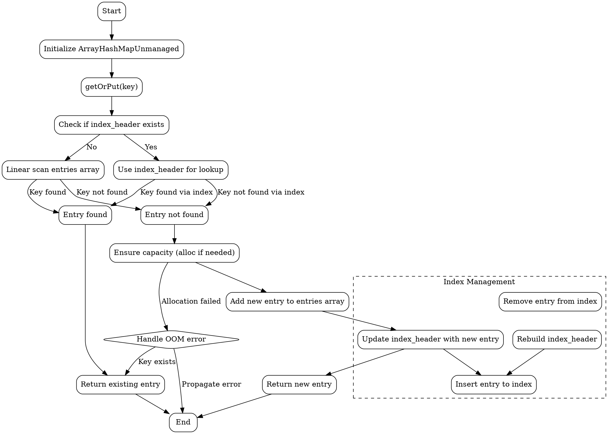

嗯，我现在需要为这个用Zig编写的ArrayHashMapUnmanaged函数画一个流程图。首先，我得仔细理解这个函数的代码结构。看起来这个函数返回一个结构体，里面有很多方法，比如初始化、插入、删除、查找等操作。流程图应该涵盖主要的流程，比如初始化、添加元素、删除元素、查找元素等步骤。

首先，我需要确定每个主要方法的关键步骤。比如，getOrPut方法可能需要检查键是否存在，如果存在则返回现有条目，否则插入新条目。同时，还要处理哈希冲突和索引管理。不过，直接画出所有方法的流程可能会太复杂，所以可能需要选择一个核心流程，比如插入元素的流程，或者查找和插入的组合流程。

另外，代码中有很多条件判断，比如是否存储哈希值，是否有索引头等。这些条件分支应该在流程图中体现出来。比如，当索引头存在时，使用索引来查找条目，否则进行线性扫描。

可能需要将流程分为几个主要部分：初始化、插入、查找、删除、重建索引等。每个部分内部有详细的步骤。例如，插入元素时，可能需要先检查容量，确保有足够的空间，然后计算哈希值，处理冲突，更新索引等。

需要注意的是，这个结构体使用了多数组列表（MultiArrayList）来存储条目，同时可能有索引头来加速查找。所以在流程图中，需要体现数据结构的变化，比如添加新条目时如何更新索引，或者删除条目时如何处理索引中的空缺。

另外，错误处理也是一个部分，比如确保容量时可能会失败，这时候需要处理错误情况。不过流程图可能更关注正常流程，错误处理可以作为分支处理。

可能需要从用户调用的方法开始，比如用户调用getOrPut，然后按照代码中的步骤逐步分解。比如：

1. 用户调用getOrPut。
2. 检查是否已经存在该键：
   a. 使用索引头查找（如果存在）。
   b. 否则线性扫描条目数组。
3. 如果存在，返回现有条目。
4. 如果不存在，检查容量，必要时扩容。
5. 添加新条目到数组。
6. 更新索引结构。
7. 返回新条目。

同时，需要考虑不同情况下的处理，比如存储哈希值和不存储哈希值时的不同处理逻辑，这会影响哈希计算和比较的方式。

在画图时，应该用不同的形状表示不同的步骤，比如菱形表示条件判断，矩形表示操作，箭头表示流程方向。例如，判断索引头是否存在是一个条件分支，根据结果进入不同的查找流程。

另外，像reIndex这样的方法会在条目被直接修改后重建索引，这部分流程可能需要单独的子流程。

可能还需要考虑并发安全和指针稳定性的处理，比如lockPointers和unlockPointers的作用，这在流程图中可能需要标注关键点，比如在修改结构前加锁，修改后解锁。

总之，需要先理清各个主要方法的逻辑步骤，然后根据这些步骤绘制流程图，确保涵盖主要路径和关键条件分支。可能需要先列出每个重要方法的步骤，再整合成一个整体的流程图。
================================================

该流程图展示了以下核心流程：
1. 初始化ArrayHashMapUnmanaged结构
2. getOrPut操作的主路径（包含索引查找和线性扫描两种方式）
3. 容量管理和错误处理
4. 索引维护子流程（重建索引、插入/删除条目）

主要特征：
- 使用菱形节点表示条件判断
- 矩形节点表示操作步骤
- 虚线框表示索引管理的子模块
- 包含错误处理分支（OOM处理）
- 展示了索引存在时的快速路径和不存在时的线性扫描路径
- 体现了Zig语言特有的内存管理特性（显式容量检查）

可以通过Graphviz工具（如dot命令）渲染生成矢量图。如需更详细的子流程（如reIndex、remove操作等），可以在此基础上继续扩展子图模块。