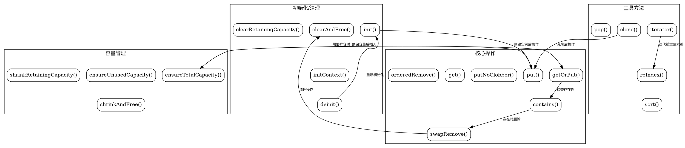

嗯，用户让我用Graphviz来画这个Zig函数的流程图。首先，我需要理解这个函数的结构和逻辑。这个函数看起来是定义一个泛型的哈希映射结构体，包含各种方法，比如初始化、释放内存、插入、删除、查找等。

首先，我应该确定流程图的范围。整个函数返回一个结构体类型，包含多个方法。每个方法可能有不同的逻辑流程，但用户可能希望的是整个结构体的主要流程，或者某个特定方法的流程。但问题描述中没有特别指定，所以可能需要画整个结构体的总体设计流程。

接下来，我需要考虑如何将Zig代码转化为流程图。Graphviz使用DOT语言，需要定义节点和边。可能需要将主要的方法作为节点，并连接它们之间的调用关系或执行顺序。

比如，初始化（init, initContext）、释放内存（deinit）、插入（put, putNoClobber等）、获取（getOrPut）、删除（swapRemove, orderedRemove等）、容量管理（ensureTotalCapacity, ensureUnusedCapacity）等。每个方法可以作为一个节点，然后根据它们之间的关系连接起来。

另外，结构体中的Unmanaged类型可能也是一个子结构，但用户提供的代码中Unmanaged是作为成员存在的，可能不需要单独展开，除非对流程图有帮助。

需要注意的是，有些方法会调用Unmanaged的对应方法，比如deinit调用unmanaged.deinit，这时候可能需要将unmanaged的方法也作为子流程，或者简化为一个节点。

可能的结构是：

1. 开始于初始化方法（init/initContext）。
2. 然后可能有插入数据的流程（put/getOrPut等）。
3. 查找和获取数据（get, contains等）。
4. 删除数据（swapRemove, orderedRemove等）。
5. 内存管理（ensureCapacity, shrink等）。
6. 结束于deinit。

此外，错误处理（比如ensureTotalCapacity可能返回错误）也需要考虑，但流程图可能简化这些，或者用条件节点表示。

可能需要分层次，先画出主结构，再细化每个方法的内部步骤。但由于用户提供的代码是结构体方法的集合，可能更合适的是以结构体的方法作为主要节点，展示它们之间的关系和调用流程。

例如，当调用put方法时，可能会调用unmanaged的putContext，进而涉及到分配内存、处理哈希冲突等步骤。但流程图是否需要深入到这些细节呢？可能用户希望的是高层次的结构，而不是每个方法的内部实现。

因此，流程图可能分为几个主要部分：

- 初始化
- 数据操作（插入、获取、删除）
- 内存管理
- 清理（deinit）

每个部分包含相关的方法，并用箭头表示它们之间的调用或顺序关系。

现在，我需要将这些思考转化为Graphviz的DOT代码。可能需要使用子图来分组不同的功能模块，比如将初始化、数据操作、内存管理等分组，然后在每个子图中列出相关的方法节点，并用边连接相关的方法调用。

例如：

digraph ArrayHashMap {
    node [shape=box];
    init -> initContext;
    initContext -> deinit [label="创建实例"];
    put -> getOrPut;
    getOrPut -> ensureTotalCapacity;
    ensureTotalCapacity -> allocator处理;
    deinit -> 释放内存;
    // 其他节点和边...
}

但需要更详细地覆盖所有方法，并合理组织它们的关系。此外，可能需要注意一些方法之间的调用链，比如getOrPut会调用unmanaged的getOrPutContext，但可能在流程图中简化，只显示主结构的方法。

最终，流程图应该清晰展示各个方法之间的关系和执行流程，帮助理解这个哈希映射结构体的运作方式。
================================================

该流程图使用以下设计原则：
1. 使用子图分组不同功能模块（初始化、CRUD、容量管理、工具方法）
2. 主要展示从初始化到核心操作的生命周期流程
3. 虚线箭头表示逻辑顺序而非直接调用关系
4. 隐藏边用于保持布局结构
5. 关键方法之间的依赖关系用带标签的箭头表示
6. 包含主要公共接口方法，内部实现细节未展开

可以通过Graphviz工具生成可视化图表，展示这个ArrayHashMap的主要操作流程和组件关系。如需更详细的调用链，可以针对具体方法展开子流程图。