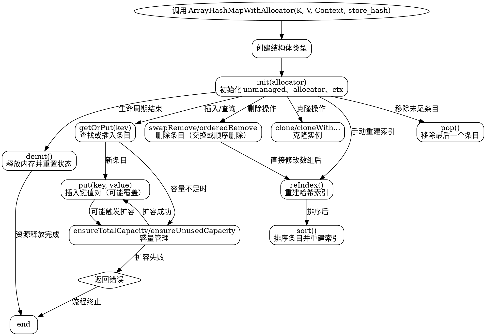

好，我需要用Graphviz来画这个Zig函数的流程图。首先，这个函数是ArrayHashMapWithAllocator，返回一个结构体类型。里面有很多方法，比如init、deinit、getOrPut等等。流程图应该展示这个函数的主要流程，包括结构体的初始化、内存管理、插入、删除、查找等操作。

首先，确定流程图的主要节点。起点应该是调用ArrayHashMapWithAllocator函数，传入K, V, Context, store_hash参数。然后生成对应的结构体类型，包含unmanaged实例、allocator和ctx。接下来是各个方法的调用，比如init初始化，deinit释放内存，getOrPut插入或获取条目，put添加键值对，remove删除条目等。

需要注意各个方法之间的调用关系，比如deinit会调用unmanaged的deinit方法，并释放allocator。getOrPut可能涉及哈希计算和冲突处理，需要分支判断是否存在现有条目。此外，错误处理也需要考虑，比如ensureTotalCapacity可能会失败，需要处理错误情况。

然后，考虑结构体中的Unmanaged类型，它可能是另一个结构体，负责底层的存储和索引管理。在流程图中，可能需要将Unmanaged的操作单独列出，比如reIndex重建索引，sort排序等。

接下来，确定各个节点之间的连接关系。例如，初始化后可以调用put或getOrPut，put可能触发容量检查，如果容量不足则扩展，成功后再插入数据。删除操作可能有swapRemove和orderedRemove两种方式，分别对应不同的底层数组操作。

在绘制流程图时，需要注意条件判断和循环，比如在插入时检查是否存在相同键，存在则覆盖，不存在则添加。同时，错误处理路径需要明确，比如ensureTotalCapacity失败时返回错误，流程终止。

另外，结构体的clone方法会创建副本，需要展示克隆过程，包括复制数据和使用相同的allocator或不同的allocator。

最后，确保流程图的逻辑清晰，节点之间的箭头正确表示执行顺序和条件分支。可能需要使用不同的形状来表示不同的操作类型，比如矩形表示过程，菱形表示判断，椭圆形表示开始和结束。

总结一下，流程图的步骤大致是：
1. 调用ArrayHashMapWithAllocator创建结构体类型。
2. 初始化结构体实例，设置allocator和context。
3. 执行各种操作方法，如插入、删除、查找等，处理可能的错误和容量调整。
4. 释放资源，处理结构体的生命周期结束。

需要详细检查每个方法的逻辑，确保流程图涵盖所有关键步骤，并正确反映代码结构。
================================================
