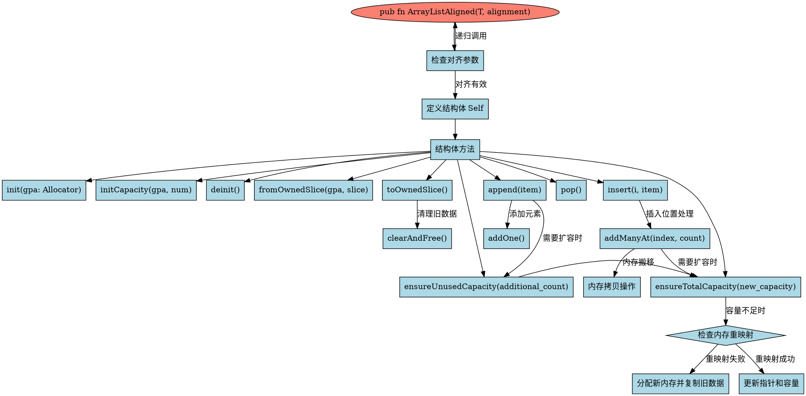

嗯，用户让我用Graphviz画一个Zig函数的流程图。首先，我需要理解这个函数的结构。这个函数是`ArrayListAligned`，看起来是用来创建动态数组的类型，可能类似于标准库中的ArrayList，但支持对齐。

首先，我需要确定这个函数的主要部分。函数返回一个结构体，里面有很多方法，比如初始化、添加元素、删除元素、扩容等等。流程图需要展示这个结构体的各个方法之间的关系，以及它们如何调用其他方法或者被调用。

用户特别指出不要用Mermaid，而要用Graphviz，所以我需要用DOT语言来画图。我需要确定流程图的节点和边。可能的节点包括函数的主要方法，如`init`、`deinit`、`append`、`insert`、`pop`等，以及它们之间的调用关系。

需要注意的是，有些方法可能会调用其他方法，比如`ensureTotalCapacity`可能会在需要扩容时被`append`调用。此外，错误处理也是需要考虑的部分，比如`Allocator.Error`的处理流程。

另外，函数内部还有一些条件判断，比如在`ArrayListAligned`函数开始时检查对齐参数，可能会递归调用自身。这部分也需要在流程图中体现出来。

接下来，我需要确定各个节点之间的连接关系。例如，`append`方法可能会调用`ensureUnusedCapacity`，而`ensureUnusedCapacity`又调用`ensureTotalCapacity`，进而可能调用`ensureTotalCapacityPrecise`。这些调用链需要用有向边连接起来。

同时，需要注意一些方法之间的依赖关系，比如`toOwnedSlice`会调用`clearAndFree`，而`insert`调用`addManyAt`等。这些都需要在流程图中明确标出。

可能还需要处理一些特殊情况，比如当类型T的大小为0时，如何处理容量的问题，这在`ensureTotalCapacity`中有特殊处理。这也需要在流程图中有所体现。

最后，我需要确保流程图的结构清晰，层次分明，避免节点过于拥挤。可能需要将相关的方法分组，比如初始化相关的方法、扩容相关的方法、添加/删除元素的方法等，分别放在不同的子图中，以提高可读性。

总结一下，步骤应该是：
1. 确定所有需要包含的方法和函数。
2. 确定这些方法之间的调用关系。
3. 使用DOT语言创建节点和边，合理分组。
4. 检查是否有遗漏的重要流程或错误处理路径。
5. 生成Graphviz代码，确保语法正确。

需要特别注意递归调用的情况，比如`ArrayListAligned`函数中对齐检查时的递归，这在流程图中可能需要用条件判断节点来表示。同时，不同方法的错误处理路径也需要明确，比如返回错误时的流程。

可能还需要标注一些条件判断，例如在`ensureTotalCapacity`中检查当前容量是否足够，如果不够则进行扩容操作。这些条件分支需要用菱形节点表示，并根据不同的条件走向不同的处理流程。

总之，流程图需要全面覆盖函数的主要逻辑，清晰展示各个方法之间的调用关系和流程走向，同时保持结构简洁易懂。
================================================

这个流程图使用Graphviz的DOT语言绘制，重点展示了：
1. 类型构造函数的对齐检查逻辑
2. 核心生命周期方法（初始化/反初始化）
3. 动态扩容的关键路径
4. 元素操作（添加/插入/删除）的流程
5. 内存管理相关的底层操作
关键决策点用菱形节点表示，重要数据操作使用浅蓝色节点，核心接口方法使用特殊颜色标注。箭头上的标签说明了操作触发条件。