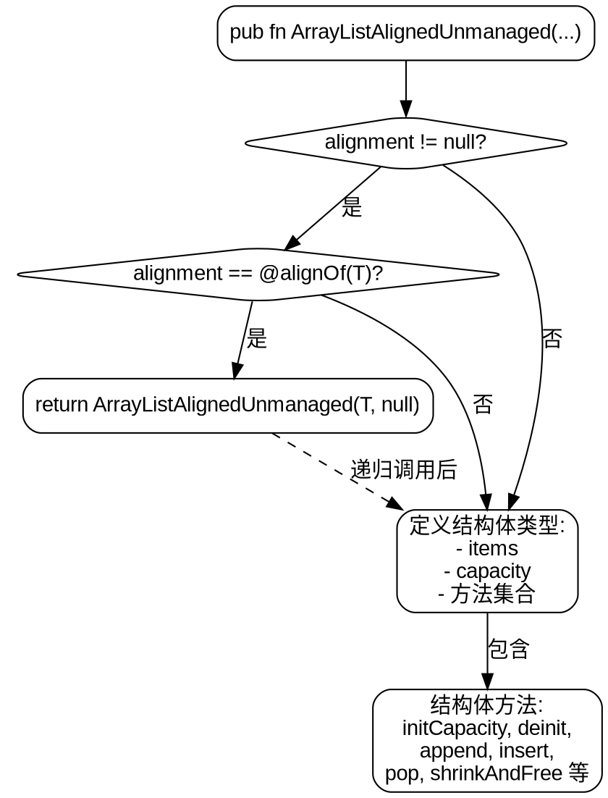

嗯，用户让我用Graphviz来画这个Zig函数ArrayListAlignedUnmanaged的流程图。首先，我需要理解这个函数的结构和逻辑。看起来这是一个泛型函数，返回一个结构体类型，里面有很多方法，比如初始化、插入、删除、扩容等等。

首先，我需要确定流程图的起点。函数开始时会检查对齐参数，如果符合条件就递归调用自身，否则返回定义的结构体。这里可能有一个条件判断分支。然后结构体内部有很多方法，每个方法可能有自己的逻辑流程，比如initCapacity、deinit、append等。

不过用户可能希望的是整个函数的流程图，而不仅仅是某一个方法。但整个函数返回的是一个结构体类型，包含多个方法，所以可能需要分层次来画。或者，可能用户希望的是函数ArrayListAlignedUnmanaged本身的流程，即函数如何根据参数生成对应的结构体类型。

比如，函数开始检查alignment是否为null或者是否等于T的对齐，如果是，则递归调用并返回新的结构体。否则，继续定义结构体。这部分可以用条件判断的节点来表示。

接下来，结构体内部的各种方法可能需要单独处理，但流程图可能会变得非常复杂。用户可能只需要主函数的流程，即创建结构体类型的过程，而不是每个方法的内部逻辑。

另外，Graphviz的语法需要正确使用节点和边，可能用digraph，节点用条件判断和操作步骤表示。例如：

- 开始节点：检查alignment是否存在
- 条件分支：alignment存在且等于T的对齐，则递归调用
- 否则，定义结构体Self，包含items和capacity等字段

然后，结构体内部的各种方法可能作为子图，但这样可能会太复杂。或者，主流程只展示函数如何生成结构体类型，而方法作为结构体的组成部分，用不同的节点表示。

可能还需要注意递归调用的情况，避免循环。例如，当alignment存在且等于T的对齐时，函数会递归调用ArrayListAlignedUnmanaged(T, null)，这时候流程需要回到初始判断。

不过，可能用户希望的是整个结构体的创建流程，包括如何处理对齐参数，生成对应的Slice类型，以及结构体中的各个方法如何被定义。但这样流程图的细节会非常多，可能需要简化。

总结来说，流程图的主要步骤可能是：

1. 检查alignment参数是否存在。
2. 如果存在且等于T的对齐，递归调用函数并将alignment设为null。
3. 否则，定义结构体类型，包含items、capacity，以及各种方法。
4. 结构体中的方法如initCapacity、deinit、append等各自有逻辑，但可能在流程图中以聚合节点表示。

接下来，我需要用Graphviz语法将这些步骤转化为图形。使用条件判断节点，比如菱形判断框，然后根据不同的条件分支到不同的操作节点。递归调用可能需要一个指向起始节点的边。

需要注意的是，Graphviz的语法结构，比如定义节点，然后用箭头连接。例如：

digraph {
    start [label="开始"]
    check_alignment [shape=diamond, label="alignment存在？"]
    start -> check_alignment
    check_alignment -> recursive_call [label="是且等于T的对齐"]
    check_alignment -> define_struct [label="否或不等"]
    recursive_call [label="递归调用ArrayListAlignedUnmanaged(T, null)"]
    define_struct [label="定义结构体Self"]
    // 其他节点和边
}

此外，结构体内部的方法可能作为define_struct的子节点，或者用另一个子图来表示。但可能为了简洁，只展示主流程，而不深入到每个方法的具体实现。

可能还需要处理错误情况，比如内存分配失败等，但用户提供的代码中很多方法返回错误，但流程图中可能不需要体现这些错误处理，除非特别要求。

最后，确保不使用Mermaid语法，而是正确的Graphviz语法。比如正确的节点定义、箭头和标签。
================================================
