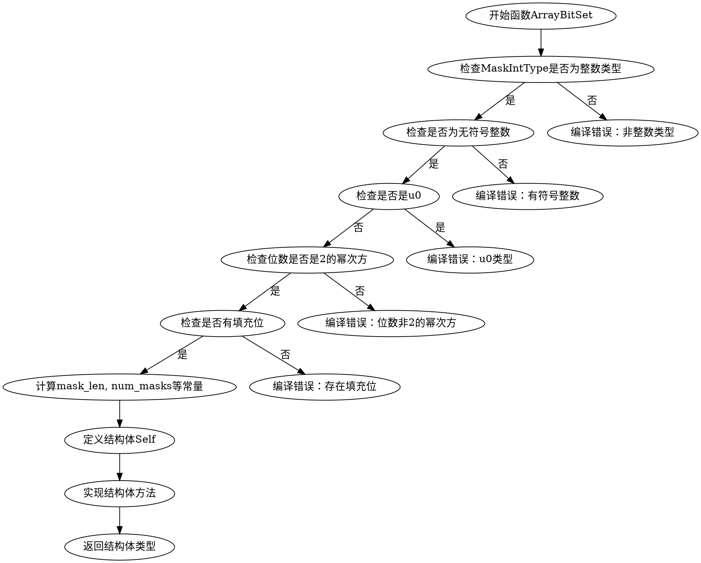
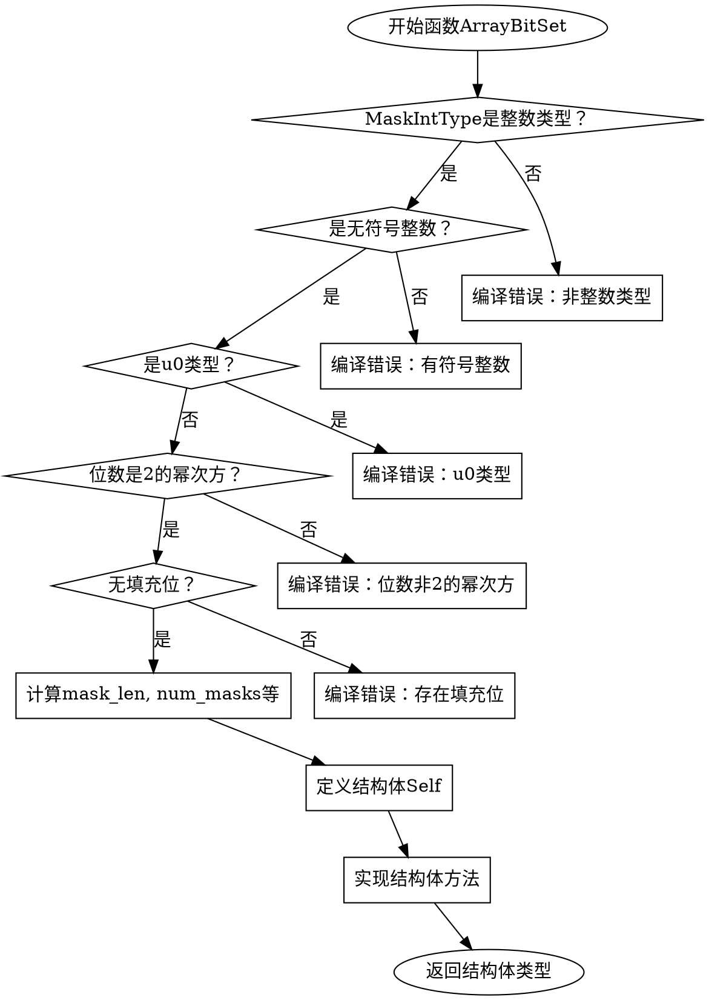
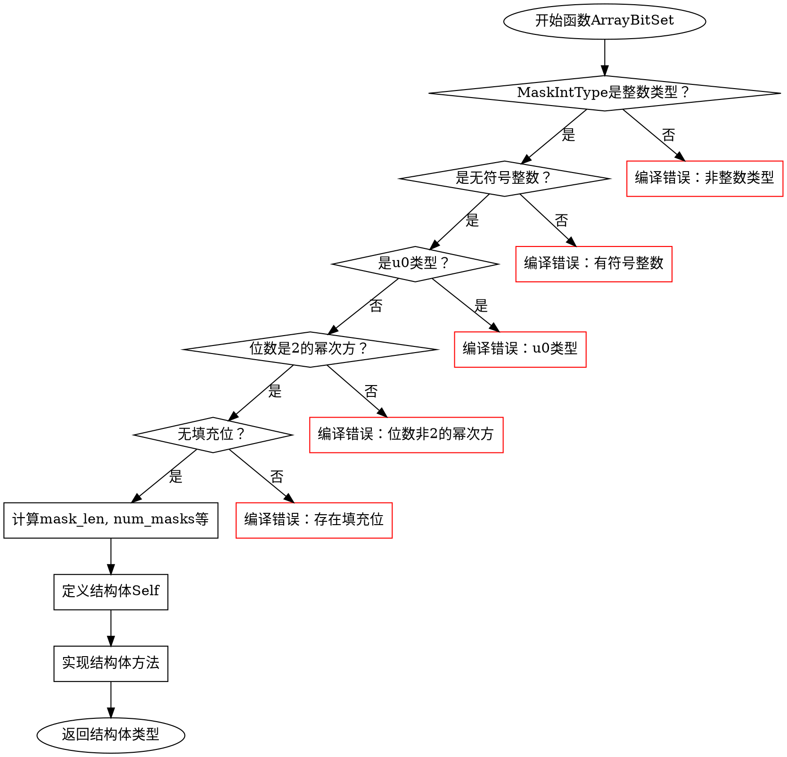

好的，我现在需要为这个Zig函数`ArrayBitSet`绘制一个流程图。首先，我需要理解这段代码的功能和结构。

这个函数看起来是一个泛型函数，用于创建一个位集合（BitSet）的类型。它接受两个参数：`MaskIntType`（掩码整数类型）和`size`（大小），然后返回一个结构体类型，该结构体实现了位集合的各种操作，如初始化、设置位、清除位、交集、并集等。

首先，我需要理清函数的主要步骤。函数开始部分进行了一系列的编译时检查，确保传入的`MaskIntType`是有效的无符号整数类型，且其位数是2的幂次方，没有填充位。然后定义了结构体的各个成员和方法。

接下来，绘制流程图的大致步骤可能是这样的：

1. **开始**：函数入口。
2. **参数检查**：检查`MaskIntType`是否为无符号整数，是否有填充位，是否是2的幂次方等。如果有错误，触发编译错误。
3. **计算掩码参数**：如`mask_len`、`num_masks`、`last_pad_bits`等。
4. **定义结构体**：包含各种方法，如`initEmpty`、`initFull`、`isSet`、`set`、`unset`等。
5. **结构体方法实现**：每个方法的具体逻辑，如设置位、清除位、切换位、集合操作等。
6. **返回结构体类型**：函数最终返回这个定义的结构体类型。

但流程图通常更关注控制流程，而这里很多是结构体的方法定义。可能更合适的流程图是针对整个函数体的主要流程，而不是每个方法。或者，可能需要为整个函数的高层结构绘制流程图，包括参数检查和结构体构造。

不过，用户可能希望的是整个函数的执行流程，包括编译时检查，然后生成结构体的过程。但结构体方法本身可能不需要详细展开，除非特别要求。

可能的流程步骤细化：

1. **开始**函数`ArrayBitSet`。
2. **检查`MaskIntType`类型**：是否是整数类型？如果不是，编译错误。
3. **检查是否为无符号整数**？如果不是，编译错误。
4. **检查是否不是u0**？如果是，编译错误。
5. **检查位数是否是2的幂次方**？如果不是，计算正确的位数并提示错误。
6. **检查是否有填充位**？如果有，提示错误并建议正确类型。
7. **计算结构体的相关常量**：如`mask_len`、`num_masks`等。
8. **定义结构体`Self`**，包含各种成员和方法。
9. **实现结构体的各个方法**，如初始化、设置位、计数等。
10. **返回结构体类型**。

这样，流程图可以按照这些步骤来绘制，每个检查步骤都有条件分支，导致可能的错误或继续执行。

需要注意，很多步骤是在编译时进行的，比如类型检查和错误提示。因此，流程图中的条件判断可能代表编译时的检查，如果失败则停止编译并报错。

对于结构体方法的实现，可能在流程图中不需要详细展开每个方法，而是作为一个整体步骤，表示结构体被定义并包含了这些方法。

现在，我需要将这些步骤转化为Graphviz的流程图。使用节点表示步骤，条件判断用菱形框，流程方向用箭头。

可能的Graphviz代码结构如下：

但可能有些条件判断的方向需要调整。例如，`check_padding`是否通过的条件是否为“是”才继续？代码中的检查是，如果`@bitSizeOf(MaskIntType)`不等于`@sizeOf(MaskIntType) * byte_size`，则报错。因此，当不满足条件时（即存在填充位），进入错误分支。所以，在流程图中，`check_padding`的“否”分支表示存在填充位，触发错误，而“是”才继续。

所以，修正后的流程：

在`check_power_of_two`之后，进入`check_padding`节点。如果检查失败（存在填充位），则跳转到`error_padding`；否则继续到`compute_constants`。

同样，其他检查的分支也需要调整，确保正确触发错误的条件。

修正后的Graphviz代码可能如下：

这样，每个检查步骤都有对应的错误处理，如果通过所有检查，才会继续定义结构体并返回。错误节点表示编译时错误，流程终止。

结构体方法的实现在`implement_methods`节点中，可能不需要进一步细分，因为这些方法属于结构体的一部分，而流程图主要描述函数`ArrayBitSet`的流程，而不是每个方法的内部逻辑。

总结，流程图展示了函数在编译时进行的各种检查，只有全部通过后才会生成并返回结构体类型。
================================================

### 流程图说明：
1. **开始函数**：函数入口。
2. **类型检查**：
   - 检查`MaskIntType`是否为整数类型，否则报错。
   - 检查是否为无符号整数，否则报错。
   - 检查是否为`u0`类型，是则报错。
   - 检查位数是否为2的幂次方，否则报错。
   - 检查是否存在填充位，否则报错。
3. **计算常量**：通过检查后，计算掩码长度、掩码数量等常量。
4. **定义结构体**：根据参数和计算出的常量定义结构体`Self`。
5. **实现方法**：为结构体添加位操作相关方法（如`set`、`unset`、`toggle`等）。
6. **返回结构体**：最终返回定义的结构体类型。

所有错误检查失败会直接触发编译错误（红色节点），终止流程。成功通过所有检查后，生成完整的位集合类型并返回。