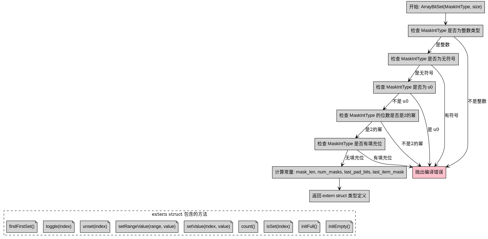

好的，我需要为这个Zig函数`ArrayBitSet`画一个流程图。首先，我得理解这个函数的结构和逻辑。这个函数看起来是用于创建一个位集合（bit set）的类型，它接受一个整数类型`MaskIntType`和大小`size`作为参数，然后返回一个结构体类型，包含各种操作位集合的方法。

首先，流程图应该从函数入口开始，也就是`pub fn ArrayBitSet(...) type {`。接下来，函数进行了一系列的编译时检查，比如验证`MaskIntType`是否为无符号整数、是否是2的幂次方、是否有填充位等等。这些检查都是通过`@compileError`在编译时触发的，所以流程图中需要体现这些条件判断的分支。

然后，函数定义了一些常量，比如`mask_len`、`num_masks`、`last_pad_bits`和`last_item_mask`。这些常量计算可能需要单独的处理步骤。

接下来是返回的结构体`extern struct`，里面包含了许多方法，如`initEmpty`、`initFull`、`isSet`、`count`、`setValue`等。每个方法可能有自己的逻辑流程，但作为整个函数的流程图，可能需要将这些方法作为子流程或模块来展示，而不是详细展开每个方法的内部逻辑。

不过，用户要求的是整个函数的流程图，而不仅仅是结构体的方法。因此，流程图的主线应该是函数`ArrayBitSet`的执行流程，包括参数检查、计算常量，最后返回结构体类型。结构体内部的方法可能作为子节点，但不需要详细展开每个方法的具体步骤。

需要注意的是，不要使用Mermaid语法，而是使用Graphviz的DOT语言。Graphviz的流程图通常由节点和边组成，节点表示步骤，边表示流程方向。

可能的流程节点包括：
1. 开始：函数入口。
2. 检查`MaskIntType`是否为整数类型。
3. 检查是否无符号。
4. 检查是否不是u0。
5. 检查是否是2的幂次方。
6. 检查是否有填充位。
7. 计算常量如`mask_len`、`num_masks`等。
8. 返回结构体类型。

每个检查步骤如果失败，会触发编译错误，这在流程图中可以用不同的节点表示，例如菱形判断节点，分支到错误处理。

此外，结构体的方法可以作为结构体节点下的子图，但根据用户需求，可能需要简化，只展示主流程，而将方法列表作为结构体的属性。

现在需要考虑如何将这些步骤用Graphviz的DOT语言组织起来，确保逻辑清晰，层次分明。可能需要使用子图来分组不同的部分，比如参数检查和结构体定义。

最后，确保流程图符合Graphviz的语法，节点和边的连接正确，没有使用Mermaid特有的元素。
================================================
