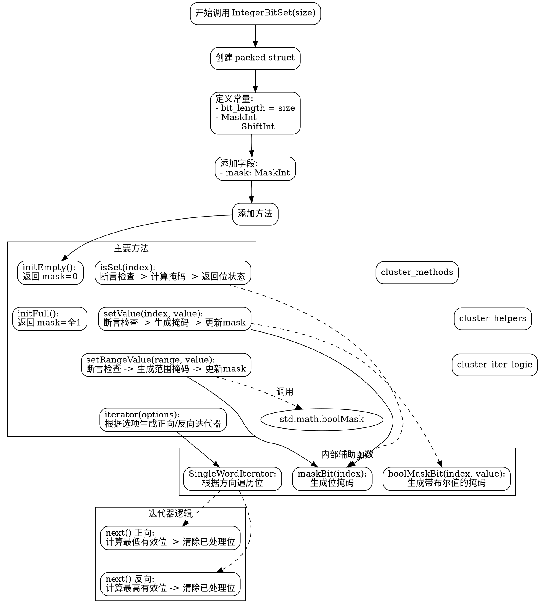

嗯，我需要为这个 Zig 语言编写的 `IntegerBitSet` 函数绘制一个流程图。首先，我得理解这个函数的结构和各个部分的功能。看起来这是一个泛型结构，用于创建基于整数的位集合。结构体有很多方法，比如初始化、设置位、清除位、交集、并集等操作。

首先，我应该确定流程图的起点和终点。起点可能是用户调用 `IntegerBitSet` 函数，生成一个特定的结构体类型。接下来，这个结构体包含多个方法，每个方法可能有不同的执行路径。例如，`initEmpty` 和 `initFull` 是初始化方法，返回不同的初始掩码值。

然后，我需要考虑各个方法之间的调用关系。比如，`setValue` 方法调用了 `maskBit` 和 `std.math.boolMask` 来设置特定的位。同时，像 `setRangeValue` 方法涉及到范围的起始和结束位置，处理掩码的生成和更新。

另外，注意到有很多断言（`assert`），这些是条件检查，应该在流程图中体现出来。例如，在 `isSet` 方法中，首先检查索引是否小于位长度，如果不满足则触发断言失败。

对于迭代器部分，`iterator` 方法返回一个迭代器结构体，根据不同的选项（如方向）遍历设置的位或未设置的位。这部分可能需要一个子流程图，展示迭代器如何逐个返回索引。

还有，位操作如按位与、或、异或等，在流程图中可能需要用不同的形状或注释来表示。例如，`toggleAll` 方法简单地对掩码取反，这在流程图中可以简化为一个操作步骤。

需要注意的是，函数中有一些条件判断，例如处理 `MaskInt` 是否为 `u0` 的情况，这可能会影响某些方法的执行路径。比如在 `setValue` 方法中，如果 `MaskInt` 是 `u0`，则直接返回，不执行后续操作。

绘制流程图时，可能需要将整个结构体作为主框，然后为每个方法绘制子流程，显示其内部逻辑。同时，需要处理错误路径（如断言失败）和条件分支。

最后，要确保流程图的逻辑清晰，层次分明，便于理解整个 `IntegerBitSet` 结构体的工作原理和各方法之间的关系。
================================================

该流程图使用 Graphviz 的 DOT 语言描述，主要包含以下部分：

1. **结构创建流程**：从入口开始依次创建结构体、定义常量、添加字段和方法
2. **核心方法集群**：展示初始化、位操作、范围操作和迭代器等主要方法
3. **辅助函数集群**：包含掩码生成等底层辅助功能
4. **迭代器逻辑子图**：详细展示正向/反向遍历位的实现逻辑
5. **隐式关联**：用虚线表示方法间的依赖调用关系

可以通过 Graphviz 工具渲染生成矢量图，推荐使用 `rankdir="TB"` (自上而下布局) 或 `rankdir="LR"` (从左到右布局) 查看不同视角的流程图。