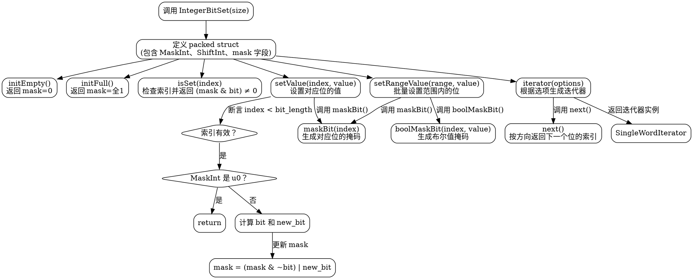

嗯，我需要为这个Zig语言写的IntegerBitSet函数画一个流程图。首先，我得理解这个函数的结构和各个方法之间的关系。这个函数返回一个packed struct，里面有很多方法，比如initEmpty、initFull、isSet、setValue等等。每个方法可能有不同的逻辑分支，比如条件判断和循环。

首先，我应该确定流程图的起点。通常，流程图从入口点开始，但这里是一个类型构造函数，可能不需要传统意义上的流程。不过，用户可能需要的是这个结构体及其方法的调用流程。或者，可能是指每个方法的内部逻辑流程图。需要明确用户的需求。

假设用户希望看到整个IntegerBitSet类型的方法调用关系，或者每个方法的内部逻辑。比如，当调用setValue时，会检查索引是否有效，然后设置对应的位。或者，整个结构体的方法之间的交互流程。

另外，用户特别提到不要用mermaid，要用graphviz。所以需要生成dot语言代码。可能需要将每个方法作为一个节点，方法之间的调用关系作为边。或者，对于每个方法内部的逻辑步骤，分解成不同的节点，比如条件判断、循环、赋值等。

例如，setValue方法：首先检查index是否小于bit_length，然后检查MaskInt是否是u0，如果是则返回。否则，计算bit和new_bit，然后更新mask。这个过程可以用几个节点表示，如“检查index有效性”、“检查MaskInt类型”、“计算bit和new_bit”、“更新mask”等，并用箭头连接这些步骤。

同样，其他方法如setRangeValue可能有更复杂的逻辑，包括多个条件判断和位运算步骤。

但考虑到整个结构体有很多方法，如果为每个方法画详细的流程图，可能会非常复杂。可能需要选择主要的方法或用户关心的部分来详细绘制，或者整体结构的高层次流程图。

另外，可能需要考虑公共接口和私有辅助函数的关系，比如maskBit和boolMaskBit是被其他方法调用的，应该在流程图中体现出来。

可能的步骤：
1. 确定流程图的覆盖范围：是整个结构体的方法调用关系，还是每个方法的内部流程？
2. 根据用户提供的代码，分析各个方法之间的依赖和调用。
3. 使用graphviz的dot语法，将每个方法作为节点，方法之间的调用作为边。
4. 对于复杂的方法，分解其内部逻辑为子图。
5. 注意条件判断和循环结构，使用菱形节点表示判断，矩形节点表示操作。

例如，initEmpty和initFull是构造函数，可能作为起点。然后其他方法如set、unset、toggle等可能被外部调用，并可能调用内部的辅助函数如maskBit。

同时，iterator方法返回一个迭代器结构，可能需要单独的流程图部分。

另外，需要注意断言（assert）的存在，这些可能代表条件判断，如果失败则可能抛出错误。

总之，需要仔细分析代码结构，将每个方法的主要步骤和逻辑分支用graphviz的节点和边表示出来，确保流程正确，不遗漏重要步骤。
================================================
要使用Graphviz绘制`IntegerBitSet`函数的流程图，可以按以下步骤生成对应的DOT代码。该流程图聚焦于**核心方法的主干逻辑**，省略了部分辅助函数和边界条件，以保持清晰。

### 流程图说明：
1. **入口**：从调用`IntegerBitSet(size)`开始，生成结构体定义。
2. **核心方法**：
   - `initEmpty`/`initFull`：初始化方法。
   - `isSet`/`setValue`/`setRangeValue`：位操作的核心逻辑。
   - `iterator`：生成迭代器，调用`next()`遍历位。
3. **辅助函数**：`maskBit`和`boolMaskBit`被多个方法调用。
4. **条件分支**：以`setValue`为例，展示索引检查和类型判断。

将上述DOT代码粘贴到Graphviz工具（如VSCode的Graphviz插件或在线编辑器）中，即可生成对应的流程图。