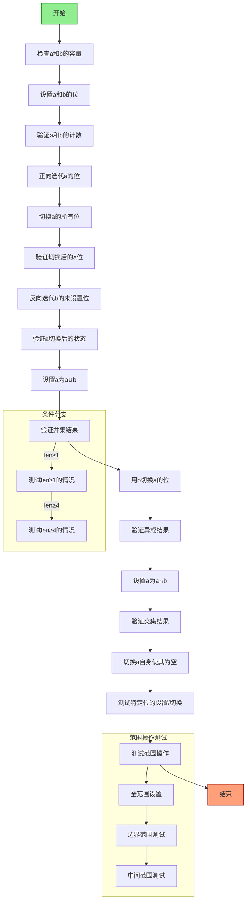

好的，我现在需要为一个用Zig编写的函数testBitSet生成流程图。首先，我得仔细阅读代码，理解它的结构和各个部分的功能。这个函数看起来是在测试一个位集合（BitSet）的各种操作，比如设置位、切换所有位、迭代器测试、集合操作（并集、交集、异或等）、范围设置以及一些边界条件的测试。

首先，我需要确定函数的主要流程。函数开始时会检查a和b的容量是否符合预期。然后，通过循环设置a和b的位，其中a的位在偶数位置设为true，b的位在i&2==0的位置设为true。接着进行各种测试，包括计数检查、迭代器正向和反向遍历、切换所有位后的检查、集合操作后的状态验证，以及范围设置的不同情况。最后还有一些特定位的测试和范围操作的边界条件测试。

接下来，流程图需要涵盖这些步骤。可能的结构包括：

1. 初始检查和设置a、b的位。
2. 验证计数是否正确。
3. 使用迭代器检查位的设置情况。
4. 切换所有位后的验证。
5. 集合操作（并集、异或、交集）的测试。
6. 范围设置的不同情况测试（全范围、单个位、边界条件等）。
7. 最后对特定测试位的设置和切换进行验证。

需要注意条件分支，比如根据len的不同值执行不同的测试（例如，当len >= 1或len >=4时才会执行某些测试）。此外，循环结构（如while循环）在流程图中需要用循环节点表示。

可能的挑战是如何将复杂的条件和循环结构简化为流程图中的节点和箭头，同时保持可读性。可能需要将某些部分拆分为子流程，例如将集合操作或范围设置作为单独的处理块。

另外，测试中的各种断言（testing.expectEqual等）需要被表示为验证步骤，如果失败则可能导致测试失败。但在流程图中，可能不需要详细展示每个断言，而是概括为验证某个条件是否成立。

最后，确保流程图覆盖所有主要步骤和分支，包括错误处理（如果有的话），但原函数似乎使用try来传播错误，所以可能需要考虑错误路径。

总结，流程图的大致步骤可能是：

开始 -> 初始化检查容量 -> 设置a和b的位 -> 验证计数 -> 迭代器测试 -> 切换所有位并验证 -> 测试并集操作 -> 测试异或操作 -> 测试交集操作 -> 切换自身并验证空集 -> 测试特定位的设置和切换 -> 测试范围设置的不同情况 -> 结束。

其中，每个主要操作步骤之间用箭头连接，条件分支（如len >=1）用判断节点表示，循环结构用循环节点表示。
================================================

该流程图描述了`testBitSet`函数的主要测试步骤：  
1. **初始检查**：验证a和b的容量。  
2. **设置位**：按规则初始化a和b的位。  
3. **计数验证**：检查a和b的已设置位数。  
4. **迭代器测试**：正向/反向遍历位并验证结果。  
5. **切换操作**：测试`toggleAll`后的状态。  
6. **集合操作**：包括并集、异或、交集及其验证。  
7. **范围操作**：测试不同范围设置（全范围、边界、中间等）。  
8. **特定位测试**：通过预设位验证`findFirstSet`和`toggleFirstSet`。  
9. **条件分支**：根据`len`的值执行不同的边界测试。