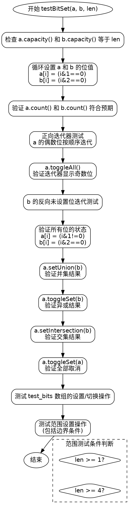

嗯，我现在需要帮用户把一个用Zig写的测试函数`testBitSet`转换成Graphviz的流程图。首先，我得仔细看看这个函数的结构和逻辑，这样才能正确地画出流程图。

首先，函数`testBitSet`接受两个参数a和b，类型是`anytype`，还有一个长度len。函数里有很多测试断言，用来验证位集合的各种操作，比如设置位、切换所有位、迭代器行为、集合操作（并集、交集）、范围设置等等。每个操作后面都有相应的测试检查。

我应该从整体上分析这个函数的流程。函数开始检查a和b的容量是否正确。然后，通过循环设置a和b的位，a的位是偶数位置设为true，b的位是i&2==0的位置设为true。接着检查它们的count是否符合预期。

之后，测试迭代器的正向和反向遍历，切换所有位后的状态，再进行并集操作，检查结果。然后进行toggleSet操作，再次设置和取消某些位，再进行交集操作。之后测试toggleSet自身，导致所有位被取消。接下来测试一些特定的位设置，使用test_bits数组，然后测试findFirstSet和toggleFirstSet的行为。最后，测试范围设置的不同情况，包括边界条件。

画流程图的时候，需要把每个主要的操作步骤作为节点，用箭头连接它们的执行顺序。需要注意条件判断和循环结构，比如if语句和while循环。不过，由于这是一个测试函数，可能每个测试步骤都是线性的，按顺序执行，每个步骤可能包含多个操作和断言。

需要注意的是，有些步骤可能包含循环，比如设置每个位的时候。在流程图中，可能需要用循环节点表示这些重复操作。但Graphviz中的流程图通常是顺序结构，对于循环可能需要简化处理，比如用“循环设置a和b的位”这样的节点，而不是详细画出循环内部每一步。

另外，测试断言部分可能不需要每个都详细画出，而是概括为检查某个条件是否符合预期。例如，“检查a和b的容量”作为一个节点，“设置a和b的位”作为另一个节点，然后是各个测试步骤。

还有，函数中有多个代码块（用大括号包裹的部分），每个代码块可能对应一个操作和测试。例如，初始化设置、迭代器测试、toggleAll测试、并集操作测试等等。这些代码块可以作为流程图中的不同节点。

在生成Graphviz代码时，需要定义各个节点，并用箭头表示执行顺序。可能还需要处理条件分支，比如当len >= 1或len >=4时的不同测试情况。这时候可能需要分支节点，但考虑到测试函数的结构，这些条件可能作为单独的测试用例分支处理。

现在，我需要把整个函数分解成主要的步骤，每个步骤作为流程图中的一个节点，并确定它们之间的顺序和可能的条件分支。然后根据这些节点和连接关系编写Graphviz的dot语言代码。

可能的主要节点包括：

1. 开始
2. 检查a和b的容量
3. 设置a和b的位值
4. 检查count是否正确
5. 正向迭代器测试
6. 切换所有位后的迭代器测试
7. 反向迭代器测试（unset）
8. 检查各个位的状态
9. 执行并集操作并验证
10. 执行toggleSet并验证
11. 执行交集操作并验证
12. 自toggleSet导致清空
13. 测试特定bits数组的设置和toggle
14. 测试范围设置的各种情况
15. 结束

每个节点之间的连接按照函数的执行顺序进行。例如，开始后检查容量，然后设置位，检查count，然后进行各种迭代器测试，依此类推。

对于条件判断，比如if (len >=1)或者循环，在流程图中可能需要用菱形判断节点，但在测试函数中，这些可能属于不同的测试用例，所以可能在流程图中作为单独的分支处理，但用户可能希望整体流程是线性的，因为函数本身可能针对不同的len值被多次调用，而每个测试步骤都是顺序执行的，不管条件是否满足。不过，函数中的某些测试步骤只在特定条件下执行，比如当len >=1时才会执行某些范围设置测试。这时候可能需要将这些条件分支体现在流程图中。

但考虑到Graphviz流程图的复杂性，可能需要简化这些条件，或者用注释节点表示条件的存在，而不详细展开每个分支。例如，节点“测试范围设置（当len >=1时）”后面跟着多个子步骤，如设置不同范围并检查结果。

另外，需要注意函数末尾的一些范围设置测试，例如设置不同的起始和结束位置，这些可能需要合并为一个节点，或者拆分成多个步骤，根据具体情况。

综上所述，流程图的结构大致是线性的，每个主要测试步骤按顺序排列，可能包含子步骤，但为了简洁，可能需要将这些子步骤合并为一个节点。例如，“测试范围设置的各种情况”作为一个节点，而内部的多个测试用例作为该节点的子过程，不在流程图中详细展开。

现在，我需要将这些步骤转换为Graphviz的dot语法。每个步骤用矩形节点表示，条件判断用菱形，但可能在这个测试函数中条件判断较少，大部分是顺序执行。循环结构可能用注释说明，而不用详细画出循环内部。

最后，确保不要使用Mermaid语法，而是正确使用Graphviz的dot语言。
================================================

该流程图使用 Graphviz 的 DOT 语言绘制，包含以下核心步骤：

1. 初始化容量验证
2. 位设置和基础计数检查
3. 迭代器功能测试（正向/反向/切换后）
4. 集合操作测试（并集/异或/交集）
5. 自反操作测试（toggle 自身清空）
6. 特定位操作测试（test_bits 数组）
7. 范围操作边界测试

虚线框中的条件判断表示范围测试中的边界条件分支（实际代码中的 `if (len >= 1)` 等），主流程保持线性执行路径。每个节点用圆角矩形表示，关键操作步骤用简短代码片段描述。