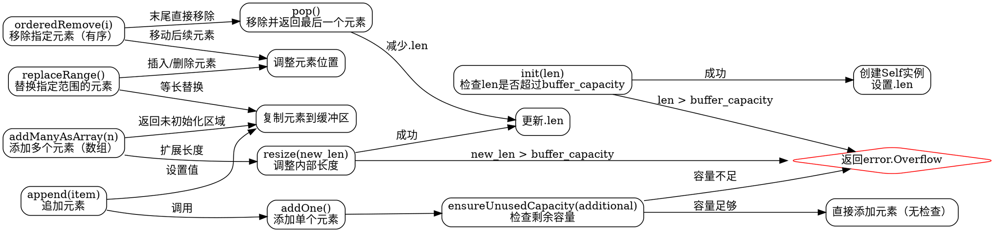

嗯，我需要为这个Zig函数生成一个流程图。首先，我需要理解这个函数的结构和各个部分的功能。这个函数叫做BoundedArrayAligned，它返回一个结构体类型，该结构体包含一个对齐的缓冲区和一个长度字段。看起来这是一个固定容量的数组实现，具有各种方法来操作数组，比如初始化、调整大小、添加元素、删除元素等。

首先，我应该确定流程图的范围。用户希望的是整个函数的流程图，也就是BoundedArrayAligned函数返回的结构体类型的所有方法的流程图吗？还是说只需要主函数的结构？根据问题描述，用户提到“函数的流程图”，可能是指整个结构体的方法流程。但可能更准确的是，用户希望看到这个泛型函数BoundedArrayAligned的流程，或者它返回的结构体类型的方法之间的关系。

不过，流程图通常是展示代码的执行流程，比如函数调用顺序、条件判断等。但这里的代码是一个泛型函数返回结构体，结构体有很多方法。每个方法都有自己的逻辑，比如init、resize、slice等。因此，可能需要为每个方法绘制子流程图，或者展示这些方法之间的调用关系。

考虑到用户要求使用Graphviz，而不是Mermaid，我需要确保生成的是DOT语言代码。Graphviz使用DOT语法来定义节点和边，描述流程图的结构。

可能的步骤：

1. 确定主要组件：结构体的各个方法。
2. 分析每个方法的逻辑，包括条件判断（如错误处理）、循环等。
3. 将每个方法分解为流程节点，比如开始、判断、操作、返回等。
4. 连接这些节点，形成流程图。
5. 确保符合Graphviz的语法，避免使用Mermaid的语法。

例如，init方法会检查长度是否超过容量，返回错误或结构体实例。这可能对应两个分支的判断节点。

但将所有方法的流程图整合到一张图中可能会非常复杂。因此，可能需要为每个方法单独绘制流程图，或者以结构体的方法作为主节点，展示它们之间的关系。

但用户可能希望的是整体结构的高层次流程图，而不是每个方法的详细流程。或者，可能希望展示结构体的创建过程以及各方法如何交互。

可能需要进一步澄清，但根据现有信息，我需要基于代码结构，提取关键函数和方法，并创建相应的流程图。

例如，主结构体有多个方法，每个方法可能有条件分支和错误处理。例如，init方法中的判断，resize中的判断，addOne中的ensureUnusedCapacity调用等。

因此，流程图可能包括：

- 创建结构体实例（init）
- 调整大小（resize）
- 添加元素（addOne, addManyAsArray等）
- 删除元素（pop, orderedRemove等）
- 其他操作（clear, replaceRange等）

每个方法的流程可以分解为步骤，如检查条件、执行操作、返回结果或错误。

例如，init方法的流程图：

开始 -> 检查len是否超过buffer_capacity -> 是 -> 返回错误Overflow
                               -> 否 -> 创建Self实例并设置len -> 返回实例

这可能对应几个节点和判断边。

同样，resize方法会检查新长度是否超过容量，然后设置len。

对于更复杂的方法，如replaceRange，可能有多个分支，根据新旧长度进行不同的处理。

但将所有方法的流程图整合到一个图中可能会显得混乱。可能需要分块处理，每个方法作为一个子图，或者选择主要方法进行展示。

考虑到用户可能希望一个整体的结构图，展示各个方法之间的关系，而不是每个方法的详细步骤。或者，可能希望主流程如初始化、添加元素、调整大小等主要操作的流程。

另外，代码中存在方法之间的调用，例如addOne调用ensureUnusedCapacity，appendSlice调用appendSliceAssumeCapacity，这些调用关系可以用边来表示。

总结，我需要将各个方法作为节点，并展示它们之间的调用关系和主要逻辑分支。此外，错误处理路径也需要展示出来。

现在，我需要将这些分析转化为Graphviz的DOT代码。例如：

digraph BoundedArray {
    // 节点定义
    init [shape=box, label="init(len)"];
    resize [shape=box, label="resize(len)"];
    addOne [shape=box, label="addOne()"];
    ensureUnusedCapacity [shape=box, label="ensureUnusedCapacity(additional)"];
    Overflow [shape=diamond, label="Overflow?"];
    
    // 边定义
    init -> Overflow;
    Overflow -> error_Overflow [label="Yes"];
    Overflow -> create_instance [label="No"];
    
    resize -> Overflow;
    Overflow -> error_Overflow [label="Yes"];
    Overflow -> set_len [label="No"];
    
    addOne -> ensureUnusedCapacity;
    ensureUnusedCapacity -> Overflow;
    // 等等
}

但需要更详细地覆盖所有主要方法和它们的关系。或者，针对每个方法单独绘制流程图。

由于时间和复杂度限制，可能需要选择主要的方法来绘制流程图，或者提供一个结构图，展示各个方法的存在和调用关系，而不是每个方法的详细步骤。

最终，用户可能需要一个高层次的结构图，展示BoundedArrayAligned生成的类型及其方法，以及方法之间的调用关系。例如，结构体的方法如init、slice、resize等，以及它们如何相互调用，如addOne调用ensureUnusedCapacity等。

因此，生成的Graphviz代码应该包含这些节点和边，以展示结构体方法之间的关系和主要逻辑流程。
================================================
要使用Graphviz绘制`BoundedArrayAligned`函数的流程图，以下是基于代码逻辑生成的DOT代码。该流程图展示了结构体的核心方法及其调用关系，包括错误处理和关键操作：

### 说明：
1. **核心方法**：如`init`、`resize`、`addOne`等，展示了参数检查和主要逻辑。
2. **错误处理**：`error.Overflow`作为公共错误节点，出现在多个可能失败的方法中。
3. **依赖关系**：例如`addOne`依赖`ensureUnusedCapacity`检查容量，`append`通过调用`addOne`实现。
4. **数据操作**：如`copy_elements`和`adjust_elements`表示内存复制或元素位置调整。

使用Graphviz渲染此DOT代码，可以生成清晰的流程图，展示方法之间的调用关系和关键逻辑分支。