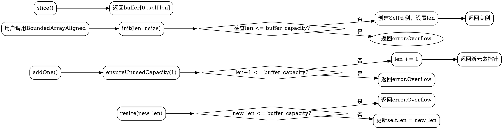

嗯，我需要用Graphviz来绘制这个Zig函数的流程图。首先，我需要理解这个函数的结构和各个方法之间的关系。这个函数叫做BoundedArrayAligned，它返回一个结构体类型，里面有很多方法，比如init、slice、resize等等。

首先，我应该确定流程图的范围。整个函数返回的是一个结构体类型，所以可能需要为每个方法绘制单独的流程图，或者整体展示结构体的主要流程。不过用户可能希望看到这个结构体的整体逻辑流程，包括各个方法之间的调用关系。

接下来，我需要识别各个方法的主要功能。例如，init方法用于初始化，可能会调用其他方法；resize调整大小，可能会触发错误检查；slice返回一个切片视图等等。然后，这些方法之间如何交互，比如addOne会调用ensureUnusedCapacity，而append会调用addOne等。

另外，错误处理也是一个重要的部分，比如Overflow错误可能在多个方法中被触发，需要在流程图中体现出来。比如init、resize、addManyAsArray等方法都可能返回error.Overflow。

我还需要考虑结构体的状态变化，比如len字段的修改，buffer的使用情况。例如，当调用resize时，len会被更新，这可能影响slice的结果。

可能的结构是从结构体的初始化开始，然后展示各个方法的调用路径和可能的分支。比如，用户调用init，如果长度超过容量则返回错误，否则创建实例。之后，用户可能调用addOne，这会检查容量，如果足够则增加长度，否则报错。

对于每个方法，我需要确定它的输入、输出、可能的错误和状态变化。例如，insert方法需要移动元素，这可能涉及内存操作，流程图中需要体现这一点。

不过，Graphviz的流程图通常是节点和边的形式，每个节点代表一个步骤或条件判断，边代表流程的方向。因此，我需要将每个方法的主要步骤分解成节点，并用箭头连接它们。

可能遇到的挑战是如何在不过于复杂的情况下清晰地展示整个结构体的逻辑。由于方法较多，可能需要分块处理，比如初始化、修改数组、访问元素等模块。

此外，需要考虑循环和条件分支，例如replaceRange方法中有多个条件判断，这需要在流程图中用菱形节点表示判断条件，并根据不同结果分叉。

最后，确保流程图的可读性，可能需要使用子图来分组相关的方法，或者使用注释节点说明关键点。

总之，我需要逐步分解每个方法，确定它们的流程步骤，然后用Graphviz的语法将这些步骤和关系可视化出来。需要注意错误处理、方法调用关系以及状态变更的关键点。
================================================

该流程图展示了以下核心逻辑：

1. **初始化流程**：用户调用`init`方法时检查容量，成功则创建实例，失败返回溢出错误
2. **添加元素**：通过`addOne`方法检查容量后增加长度
3. **调整大小**：通过`resize`方法进行容量校验
4. **切片操作**：直接返回当前有效长度的切片
5. **错误处理**：统一用红色菱形节点表示容量检查，黄色节点表示错误返回

不同颜色表示：
- 蓝色：初始化相关操作
- 绿色：数据添加操作
- 橙色：容量调整操作
- 紫色：基础数据访问操作
- 红色：关键判断节点
- 黄色：错误处理路径

各方法间的调用关系通过箭头方向表示，关键判断逻辑使用菱形节点，最终操作结果用椭圆形节点表示。