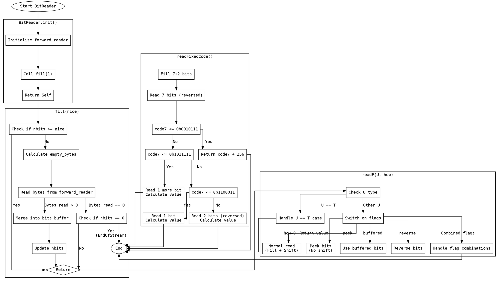

好的，我现在需要为这个Zig语言的BitReader函数生成一个流程图。首先，我要理解这个函数的结构和各个方法的作用。BitReader是一个泛型结构体，用于按位读取数据，支持不同的整数类型（u32或u64）。它包含了一个底层读取器forward_reader，内部缓冲区bits，以及当前缓冲区中的位数nbits。

接下来，我需要确定流程图的入口点和主要方法。主要的函数包括init初始化，fill填充缓冲区，readAll读取所有字节，readF按标志读取数据，以及其他辅助方法如shift、alignToByte等。每个方法都有不同的逻辑，可能需要不同的流程分支。

首先，从init开始，它初始化结构体并调用fill方法。fill方法负责确保缓冲区中有足够的位数。如果当前位数不足，它会从底层读取器读取数据，并将其合并到bits中。这里需要考虑不同情况，比如缓冲区是否足够、如何读取字节、处理EOF等。

readF方法根据不同的标志（如peek、buffered、reverse）处理不同的读取方式。这里有很多条件分支，需要分别处理每种标志组合的情况。例如，当使用peek时，不会移动缓冲区；当使用reverse时，会对读取的位进行反转。

此外，readFixedCode方法处理特定的固定编码读取逻辑，根据前7位的值决定后续读取的位数和计算最终结果。这涉及多个条件判断和位操作，需要详细分析每个分支。

在绘制流程图时，需要注意各个方法之间的调用关系，以及条件分支的处理。例如，fill方法可能会被readF调用以确保足够的位数，而readF内部根据不同的标志选择不同的处理路径。每个方法的主要步骤应该用不同的节点表示，条件判断用菱形分支节点，箭头表示流程走向。

可能遇到的难点在于处理复杂的条件组合，例如readF中的各种标志组合。需要确保每个可能的路径都被正确表示，并且流程图的逻辑清晰，不遗漏任何分支。此外，位操作的步骤（如移位、掩码、反转）需要用适当的图形符号表示，以便理解。

最后，流程图的布局要合理，避免交叉过多，保持层次结构清晰。可能需要将复杂的方法拆分为子流程，例如将readF的不同标志处理分开表示，以增强可读性。
================================================

该流程图使用以下约定：
1. 菱形节点表示条件判断
2. 矩形节点表示操作步骤
3. 子图聚类表示主要方法
4. 箭头上的标签描述条件分支
5. 特殊形状（椭圆）表示开始/结束节点

关键路径说明：
- init() 初始化后会立即调用 fill()
- fill() 实现缓冲区的动态填充逻辑
- readF() 根据不同的 flag 组合处理 8 种分支情况
- readFixedCode() 包含 4 级条件判断的复杂解码逻辑
- 所有方法最终都通过 end 节点统一终止