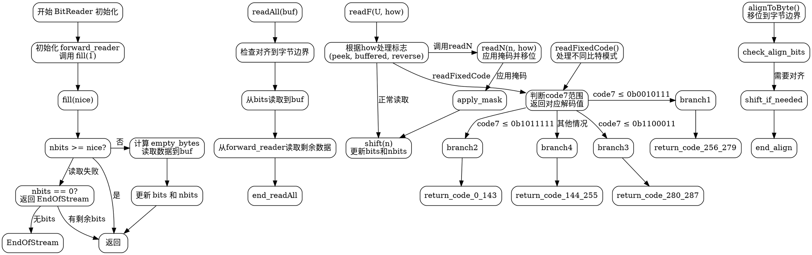

嗯，我需要为这个Zig代码中的BitReader函数绘制流程图。首先，我得理解这个BitReader的结构和各个方法的作用。看起来这是一个用于按位读取数据的结构，支持不同的整数类型（u32或u64），并且有一个底层的读取器（ReaderType）来填充缓冲区。

首先，我应该从主结构开始。BitReader是一个泛型结构，根据T和ReaderType的不同而变化。结构内部有forward_reader、bits和nbits这几个成员变量。接下来，各个方法如init、fill、readAll、readF等需要被分解成流程图的节点。

比如，init方法初始化BitReader，设置forward_reader，并调用fill方法。fill方法负责确保缓冲区中有足够的比特数，如果不够就从底层读取器读取数据。这里需要注意处理边界情况，比如读取的字节数不足或者到达流的末尾。

readF方法比较复杂，因为它处理不同的标志位组合，比如peek、buffered、reverse等。不同的标志位会影响如何读取和移动缓冲区中的比特。需要为每个标志位组合绘制不同的分支。

另外，readFixedCode方法涉及到根据不同的比特模式解析固定编码，这需要多个条件判断和比特操作，这部分在流程图中应该表现为多个决策节点和不同的处理路径。

在绘制流程图时，需要确保每个函数的入口和出口清晰，条件判断分支明确，循环结构正确表示。例如，fill方法中的循环读取直到满足nice比特数，或者readAll中的循环读取直到填满缓冲区。

可能遇到的困难是处理各种标志位的组合以及不同情况下的比特操作，需要仔细检查每个条件分支，确保流程图的准确性和完整性。此外，需要正确表示错误处理，比如EndOfStream错误的抛出条件。

总之，流程图应该从BitReader的初始化开始，展示各个方法的调用流程，特别是fill和readF中的复杂逻辑。使用不同的节点表示函数调用、条件判断、循环和错误处理，确保整个流程清晰易懂。
================================================

该流程图的关键节点说明:
1. 初始化流程展示BitReader的创建过程
2. fill方法的核心逻辑和错误处理
3. readAll方法的分阶段读取策略
4. readF方法的多标志位处理分支
5. readFixedCode的复杂解码逻辑分支
6. 关键位操作步骤(移位/掩码/对齐等)
7. 错误处理路径(EndOfStream)

流程图采用分层结构，左侧展示初始化流程，中间是核心读取方法，右侧处理特殊解码逻辑。实线箭头表示正常流程，虚线箭头表示错误路径。不同颜色区块可用于区分不同功能模块(建议在渲染时添加颜色)。