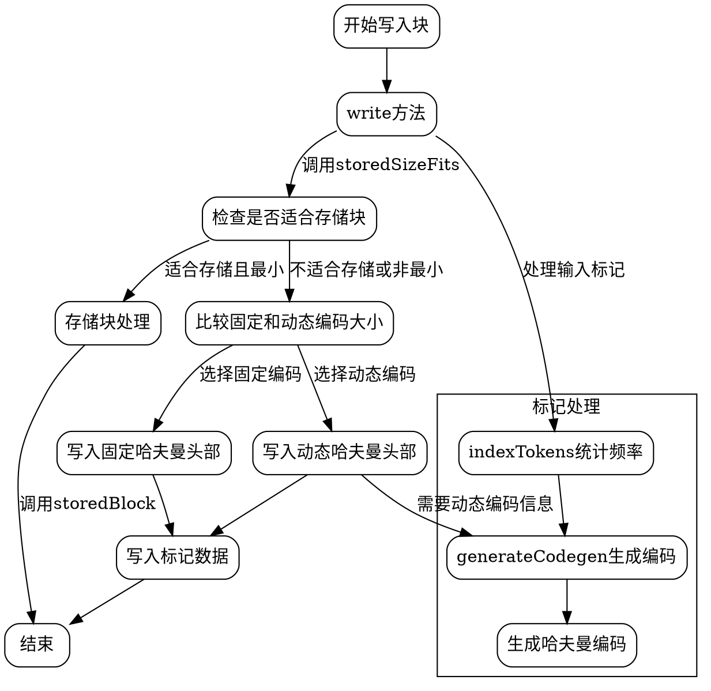

嗯，我现在需要为这个用Zig编写的BlockWriter函数画一个流程图。首先，我需要理解这个函数的结构和主要功能。看起来这是一个用于压缩数据的模块，特别是实现Flate算法的块写入器。让我仔细看一下代码。

首先，BlockWriter是一个泛型结构体，接受一个WriterType作为参数。它内部使用了BitWriter来处理位级别的写入。结构体中有很多字段，比如各种频率数组（literal_freq、distance_freq）、编码器（literal_encoding、distance_encoding）等。主要的方法包括init初始化，flush刷新缓冲区，setWriter设置新的写入器，还有各种写入块的方法，比如write、storedBlock、dynamicBlock、huffmanBlock等。

接下来，我需要理清各个方法之间的调用关系。例如，write方法会根据不同的情况选择存储块、固定哈夫曼编码或动态哈夫曼编码。在write方法中，会调用indexTokens来处理标记，生成相应的频率统计，然后计算不同编码方式的大小，选择最优的编码方式。而indexTokens方法会统计literal和distance的频率，并生成对应的哈夫曼编码。

然后，generateCodegen方法用于生成codegen数组，这个数组用于动态哈夫曼编码的头部信息。dynamicHeader方法负责写入动态哈夫曼块的头部信息，包括literal、distance的数量，codegen的数量等。fixedHeader则是写入固定哈夫曼块的头部。

还有一些辅助函数，如storedSizeFits判断是否适合存储块，dynamicSize和fixedSize计算不同编码方式的大小，writeTokens实际写入标记数据等。

现在，我需要将这些步骤转化为流程图。流程图应该从write方法开始，根据不同的条件分支到不同的块类型（存储块、固定哈夫曼、动态哈夫曼）。每个块类型内部又有各自的处理步骤，比如生成频率统计、生成编码、写入头部信息、写入数据等。

需要注意各个方法之间的调用顺序和条件判断。例如，在write方法中，首先计算存储块的可能性，然后比较固定和动态哈夫曼的大小，选择最小的，最后决定写入哪种块类型。此外，错误处理和flush操作也需要考虑进去。

可能遇到的困难是如何将复杂的条件判断和循环结构简化为流程图中的节点和分支。例如，generateCodegen中的循环处理codegen数组的生成，这部分可能需要简化为一个处理节点，而不是详细画出每个循环步骤。

另外，需要确认各个函数之间的关系，比如indexTokens被write调用，而indexTokens内部又会调用generate方法生成哈夫曼编码。这些调用关系需要用箭头连接起来。

最后，需要确保流程图的层次清晰，主流程从写入块开始，分支到不同的编码方式，每个编码方式有各自的子流程，最终写入数据并结束。
================================================
