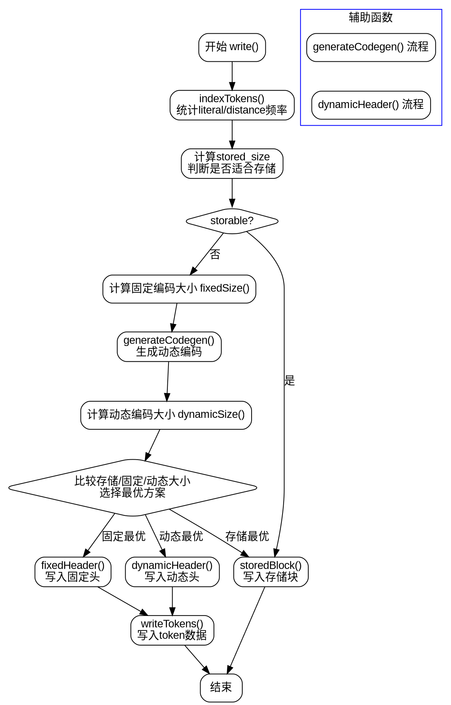

好的，我需要为提供的Zig代码中的BlockWriter函数绘制流程图。首先，我需要理解这段代码的结构和各个函数的作用。

首先，BlockWriter是一个泛型结构体，接收一个WriterType类型参数，并返回一个结构体。这个结构体包含多个字段，如bit_writer、各种频率数组、编码器等。主要的方法包括init、flush、setWriter、writeCode、generateCodegen、dynamicSize、fixedSize、storedSizeFits、dynamicHeader、storedHeader、fixedHeader、write、storedBlock、dynamicBlock、indexTokens、writeTokens、huffmanBlock和histogram。

我需要确定主要流程的入口点。看起来主要的写入操作是通过write方法处理的，它会根据不同的情况选择存储块、固定Huffman编码或动态Huffman编码。因此，流程图应该从write方法开始，然后分支到不同的处理路径。

接下来，分析write方法的逻辑：

1. 首先调用indexTokens处理tokens，统计literal和distance的频率。
2. 计算可能的存储块大小，判断是否适合存储。
3. 计算固定Huffman编码的大小。
4. 生成动态编码的codegen，计算动态编码的大小。
5. 比较存储、固定和动态的大小，选择最小的。
6. 根据选择写入相应的块头和数据。

此外，还有处理存储块的storedBlock，处理动态块的dynamicBlock，以及处理Huffman块的huffmanBlock等方法需要考虑。

在绘制流程图时，需要注意各个函数之间的调用关系，条件判断（如是否storable，选择哪种编码方式），以及循环结构（如生成codegen时的循环处理）。

需要注意不要遗漏错误处理和资源管理，例如flush操作确保缓冲区写入。同时，确保各个分支的路径清晰，比如当存储块更优时直接写入存储块，否则继续比较固定和动态编码。

可能的结构：

- 开始于write方法
- 分支1：检查是否适合存储块，如果是，调用storedBlock
- 分支2：计算固定编码大小
- 分支3：生成动态编码，计算动态编码大小
- 比较各分支的大小，选择最小的
- 写入相应的头信息（fixedHeader或dynamicHeader）
- 写入tokens数据（writeTokens）

此外，indexTokens和generateCodegen等辅助函数需要作为子流程处理。

需要注意循环结构，比如在generateCodegen中的循环处理codegen数组，统计频率，生成编码。这些循环在流程图中需要用循环节点表示。

最后，确保所有可能的路径都被覆盖，包括错误处理和边界条件，例如当没有匹配时处理distance_freq的情况。
================================================
