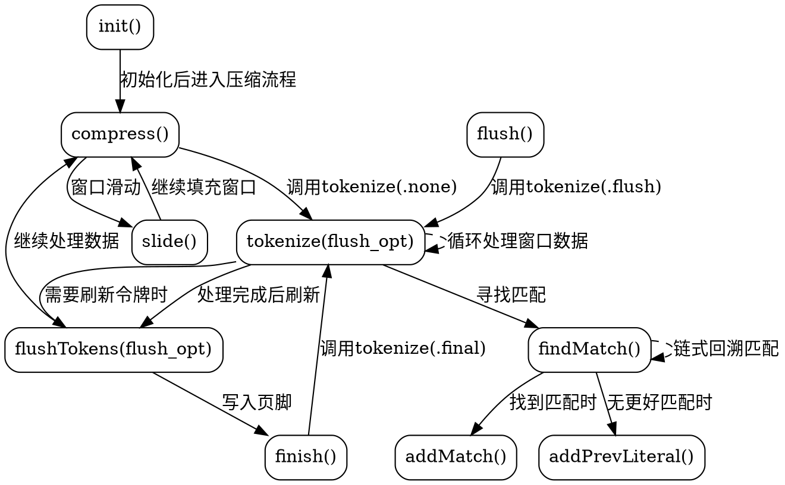

好的，我需要为提供的Zig代码中的Deflate函数生成一个Graphviz流程图。首先，我需要理解代码的结构和各个函数之间的关系。

首先，函数Deflate是一个返回结构体的泛型函数，接受container、WriterType和BlockWriterType作为参数。结构体内部有多个字段和方法，如init、tokenize、windowAdvance、addPrevLiteral、addMatch、findMatch、flushTokens、slide、compress、flush、finish、setWriter以及Writer相关的方法。

我需要确定主要流程，特别是compress、flush、finish这些公共方法如何调用内部方法。例如，compress方法会填充窗口，处理数据，生成令牌，滑动窗口等。tokenize方法负责处理窗口中的数据，寻找匹配项，生成令牌，并可能触发flushTokens。flushTokens则涉及写入块和可能的填充。

接下来，需要确定各个函数之间的调用关系，并将其转化为流程图节点和边。例如：

1. compress调用tokenize(.none)，然后可能调用slide。
2. tokenize内部循环处理窗口数据，调用findMatch、addMatch、addPrevLiteral，最终可能调用flushTokens。
3. flushTokens调用block_writer的方法，处理令牌，写入块，并根据flush选项进行填充。
4. finish调用tokenize(.final)并写入页脚。

需要注意的是条件判断和循环结构，例如在tokenize中的while循环，findMatch中的循环查找匹配项，以及flushTokens中的不同flush选项处理。

可能的结构图节点包括：compress、tokenize、findMatch、addMatch、addPrevLiteral、flushTokens、slide、flush、finish等。边表示函数调用顺序和条件分支。

此外，需要考虑错误处理和不同选项（如FlushOption的不同枚举值）对流程的影响，但在流程图中可能简化为条件节点。

最后，确保使用Graphviz的正确语法，用正确的节点和箭头表示流程，避免使用Mermaid语法。
================================================
