嗯，我需要帮用户用Graphviz画出这个Zig函数的流程图。首先，我需要仔细阅读这个Deflate函数的代码，理解它的结构和各个部分的功能。看起来这是一个实现DEFLATE压缩算法的模块，涉及到滑动窗口、哈希查找、令牌生成等步骤。

首先，这个函数是一个泛型结构体，接收container、WriterType和BlockWriterType作为参数。结构体内部有多个成员变量，比如lookup、win、tokens、wrt等。接下来，有init函数初始化这些成员，并调用container的writeHeader方法。

然后，tokenize函数是关键，它处理窗口中的数据，生成令牌。这里会涉及到查找匹配（findMatch）、添加字面量或匹配（addLiteral/addMatch）、窗口滑动（windowAdvance）等步骤。根据flush_opt的不同，处理逻辑也会变化，比如是否需要刷新令牌到块写入器。

接下来是flushTokens函数，负责将令牌写入块写入器，并根据flush选项处理存储块和刷新。此外，还有compress函数，负责从reader读取数据填充窗口，并进行处理。flush和finish函数用于处理缓冲区的刷新和结束压缩流。

现在，我需要将这些步骤转化为流程图。流程图应该从调用compress开始，然后进入循环填充窗口，处理令牌，滑动窗口。tokenize函数内部有多个分支，比如是否找到匹配，是否需要添加前一个字面量，处理不同的flush选项等。flushTokens会根据选项写入块，并可能添加存储块。finish函数最后处理最终的块并写入页脚。

需要注意的是，各个函数之间的调用关系，循环结构，条件判断（如是否flush，是否找到匹配）都需要在流程图中体现。可能需要使用子图来组织不同函数的内部流程，比如将tokenize、findMatch、flushTokens作为子流程展开。

另外，Graphviz的语法需要正确使用节点、边、条件分支的表示。例如，菱形节点表示条件判断，矩形节点表示处理步骤，箭头表示流程方向。可能需要为每个主要函数创建一个子图，并在主流程中引用这些子图。

需要确保流程图的逻辑清晰，能够展示出Deflate函数从初始化到处理数据，再到刷新和结束的整个过程。可能需要多次调整节点和连接，确保所有重要的步骤都被覆盖，并且结构合理，避免交叉线过多导致难以阅读。
================================================

```dot
digraph DeflateFlow {
    rankdir=LR;
    node [shape=rectangle, style=rounded];

    start [label="开始调用Deflate函数"];
    init [label="初始化结构体\n调用container.writeHeader"];
    compress [label="compress函数\n循环填充窗口"];
    process_window [label="处理窗口数据\ntokenize(.none)"];
    slide_window [label="滑动窗口\nslide()"];
    check_reader [label="检查reader是否为空"];
    flush [label="flush函数\ntokenize(.flush)"];
    finish [label="finish函数\ntokenize(.final)\n写入页脚"];

    // Tokenize子流程
    subgraph cluster_tokenize {
        label="tokenize函数";
        tokenize_start [label="开始tokenize"];
        check_flush [label="是否需要flush？", shape=diamond];
        process_lookahead [label="处理活动lookahead缓冲区"];
        find_match [label="查找匹配\nfindMatch()"];
        add_prev_literal [label="添加前一字面量\naddPrevLiteral()"];
        add_match [label="添加匹配\naddMatch()"];
        window_advance [label="窗口前进\nwindowAdvance()"];
        handle_flush [label="处理flush选项\n添加剩余字面量"];

        tokenize_start -> check_flush;
        check_flush -> process_lookahead [label="是"];
        process_lookahead -> find_match;
        find_match -> add_prev_literal [label="找到匹配"];
        add_prev_literal -> add_match;
        add_match -> window_advance;
        find_match -> check_prev [label="未找到匹配"];
        check_prev [label="检查前一个匹配", shape=diamond];
        check_prev -> write_prev_match [label="存在"];
        check_prev -> add_prev_literal [label="不存在"];
        write_prev_match [label="写入前一个匹配"];
        window_advance -> process_lookahead [label="继续处理"];
        process_lookahead -> handle_flush [label="处理完成"];
        handle_flush -> flush_tokens;
        flush_tokens [label="flushTokens()\n写入块并重置"];
    }

    // 主流程
    start -> init;
    init -> compress;
    compress -> check_reader;
    check_reader -> process_window [label="有数据"];
    process_window -> slide_window;
    slide_window -> check_reader;
    check_reader -> flush [label="需要flush"];
    flush -> finish [label="最终处理"];
    finish -> end [label="完成"];

    // 跨集群连接
    process_window -> tokenize_start [ltail=process_window];
    flush -> tokenize_start [ltail=flush];
    finish -> tokenize_start [ltail=finish];
    flush_tokens -> compress [label="返回"];
}
```
