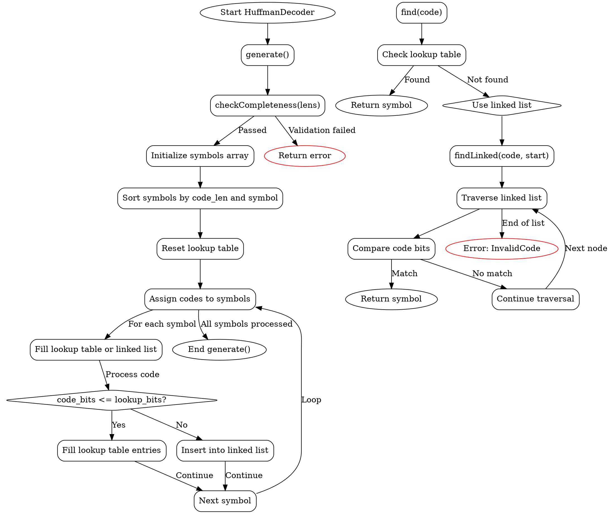

嗯，我现在需要帮用户分析他们提供的Zig代码中的HuffmanDecoder函数，并生成一个Graphviz的流程图。首先，我得仔细看一下这段代码的结构和各个部分的功能。

首先，这个HuffmanDecoder是一个泛型函数，接受三个编译时常量参数：alphabet_size、max_code_bits和lookup_bits。它返回一个结构体类型，里面包含符号表和查找表，还有一些方法，比如generate、checkCompleteness、find和findLinked。

我需要确定流程图的起点。通常，流程图从函数入口开始，但用户可能想要整个HuffmanDecoder的结构和主要方法的流程。可能需要分几个部分来画，比如生成符号表和查找表的流程，检查完整性的流程，查找符号的流程等。

generate方法负责根据给定的码长生成符号和查找表。首先调用checkCompleteness来验证码长的合法性。然后初始化符号数组，根据不同的索引设置不同的符号类型（literal、end_of_block、match）。接着对符号进行堆排序。之后重置查找表，然后为每个符号分配代码，填充查找表。这里有一个分支，根据码长是否小于等于lookup_bits来决定是直接填充查找表还是使用链表结构。

checkCompleteness函数检查码长是否构成一个规范的霍夫曼编码。首先检查是否有结束块符号，然后统计各个码长的出现次数，计算剩余的可能编码数，确保没有过度订阅或不完整的情况。

find方法首先尝试在查找表中查找符号，如果找不到，则通过链表查找。findLinked函数遍历链表，比较高位比特是否匹配，直到找到符号或返回错误。

现在需要考虑如何将这些步骤转换为流程图。每个函数的主要步骤应该作为节点，条件判断作为分支。例如，generate函数中的步骤：初始化符号数组、排序、填充查找表、分配代码时的条件判断等。

需要注意流程图的连贯性，确保各个步骤之间的连接正确。例如，generate函数开始于调用checkCompleteness，接着初始化符号，排序，重置查找表，然后循环处理每个符号，根据码长填充查找表或链表。这部分可能会有循环结构，比如for循环遍历符号数组。

对于checkCompleteness函数，流程可能包括统计码长、检查最大码长、计算剩余编码数等步骤，如果出现错误条件则返回错误。

在绘制流程图时，应使用不同的形状区分处理步骤（矩形）、判断（菱形）、开始/结束（椭圆形）等。例如，每个函数的开始和结束用椭圆形，判断条件用菱形，处理步骤用矩形，错误处理用不同的颜色或形状。

此外，需要注意函数之间的调用关系，比如generate调用checkCompleteness，find调用findLinked。这些调用关系可以用子流程的方式表示，或者在主流程图中详细展开。

最后，确保流程图符合Graphviz的语法，不要使用Mermaid的语法。用户特别强调不要错误使用Mermaid，所以必须用Graphviz的dot语言来编写。

总结步骤：
1. 确定各个主要函数的结构和流程。
2. 将每个函数分解为流程图中的节点和分支。
3. 处理循环和条件判断的结构。
4. 使用正确的图形符号表示不同元素。
5. 确保流程图的逻辑正确性和连贯性。
================================================

该流程图包含两个主要部分：
1. **generate()** 方法流程：
   - 检查码表完整性
   - 初始化符号表
   - 排序符号
   - 填充查找表（包含分支逻辑处理不同码长情况）

2. **find()** 方法流程：
   - 快速查找查找表
   - 未命中时遍历链表查找
   - 包含错误处理路径

使用 Graphviz 渲染时注意：
1. 菱形节点表示条件判断
2. 红色节点表示错误终止路径
3. 椭圆节点表示流程开始/结束
4. 主要处理逻辑用矩形节点表示