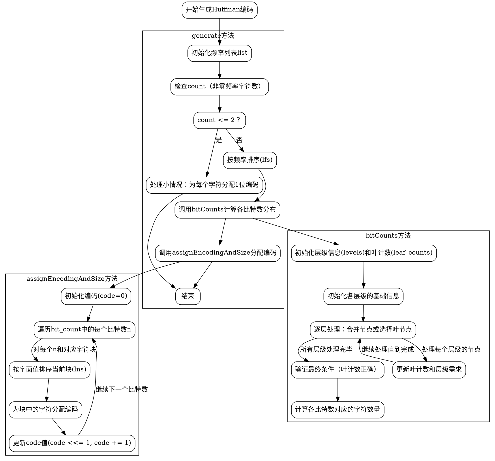

嗯，用户让我用Graphviz画出这个Zig函数的流程图。首先，我需要理解这个HuffmanEncoder的结构和各个方法的作用。看起来这个结构体主要用于生成霍夫曼编码，包含了一些方法如generate、bitLength、bitCounts和assignEncodingAndSize。

首先，generate方法是核心，它根据频率数组生成霍夫曼编码。处理逻辑包括处理小情况（count <= 2），排序，计算比特数分配，最后分配编码。bitCounts方法比较复杂，涉及到位数的计算和层次信息的管理。assignEncodingAndSize负责根据计算出的比特数分配具体的编码值。

接下来，我需要将这些方法中的逻辑步骤转化为流程图。流程图通常包括开始、结束、判断、处理步骤等。需要注意的是循环和条件分支的结构。

比如，generate方法中的步骤：

1. 初始化频率列表。
2. 处理count <= 2的情况。
3. 排序频率列表。
4. 调用bitCounts计算各个比特数对应的字符数量。
5. 调用assignEncodingAndSize分配编码。

bitCounts中的步骤可能涉及多层循环和条件判断，处理各个层级的节点信息，确保不超过最大比特数限制，并计算每个层级的必要节点数。

assignEncodingAndSize则根据bit_count分配具体的编码，按字面值排序后设置每个字符的霍夫曼编码。

在绘制流程图时，需要将这些步骤分解为不同的节点，并用箭头连接，展示执行顺序和条件分支。比如，在generate方法中，判断count <= 2会导致不同的处理路径。

可能遇到的难点是如何正确表示递归或循环结构，尤其是在bitCounts中的多层循环和条件处理。需要确保每个循环的入口和出口正确标注，条件判断清晰。

另外，函数之间的调用关系也需要在流程图中体现，例如generate调用bitCounts和assignEncodingAndSize，这两个方法内部的逻辑也需要展开。

最后，生成的Graphviz代码需要正确使用节点、箭头、标签，确保逻辑清晰，结构合理。可能需要使用子图来分组不同的方法，或者将整个流程分为主要步骤和子步骤。

需要检查是否有遗漏的逻辑分支，比如错误处理或特殊情况，但根据代码注释，似乎已经处理了0、1、2字符的情况，其他情况由通用代码处理。

总结下来，流程图的绘制需要分步骤分解每个方法的逻辑，处理条件判断和循环，正确表示函数调用关系，并确保整体结构易于理解。
================================================

此流程图包含三个主要子图：

1. **generate方法**：处理频率表初始化、小情况处理、排序及编码分配。
2. **bitCounts方法**：通过层级计算确定每个比特数对应的字符数量。
3. **assignEncodingAndSize方法**：按字面值排序并为字符分配具体编码。

箭头表示执行顺序，菱形节点表示条件判断，矩形节点表示操作步骤。流程从`generate`开始，依次调用`bitCounts`和`assignEncodingAndSize`，最终结束。