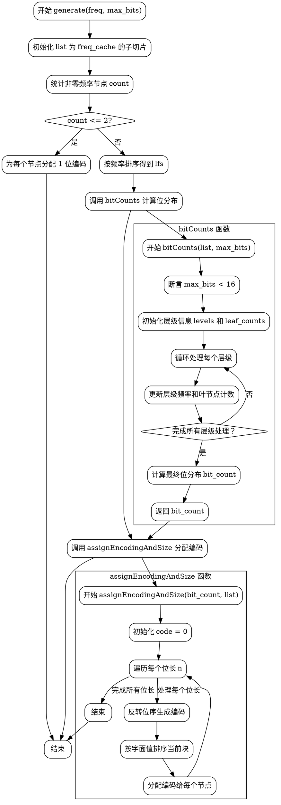

嗯，我现在需要根据提供的Zig代码中的HuffmanEncoder的generate函数来画一个流程图。首先，我得仔细读代码，理解它的逻辑。

generate函数的主要步骤似乎是处理频率数组，生成霍夫曼编码。首先，它会创建一个包含非零频率的节点列表。如果节点数小于等于2，直接分配位长为1的编码。否则，对节点按频率排序，然后计算每个位长的数目，最后分配编码。

接下来，bitCounts函数负责计算每个位长的出现次数。这里可能涉及到构建霍夫曼树的不同层级，处理叶节点和内部节点的频率。然后assignEncodingAndSize函数根据这些位长分配具体的编码值，可能涉及到反转位序。

流程图应该从generate开始，分支处理count<=2的情况，否则进入排序、计算位数量、分配编码的步骤。每个步骤需要分解子步骤，比如排序、初始化层级信息、处理每个层级的频率、计算位计数，最后分配编码。

需要注意的是，流程图中需要正确表示循环和条件判断。例如，在bitCounts函数中的循环处理各个层级，可能需要循环结构。同时，错误处理或断言也需要标记出来。

可能遇到的困难是如何准确表达层级处理中的循环和条件分支。另外，确保各个函数之间的调用关系清晰。比如generate调用bitCounts，后者又涉及复杂的数据结构操作。

现在我需要将这些步骤转化为Graphviz的流程图。使用节点表示各个步骤，箭头表示流程方向，条件判断使用菱形框，循环用适当的结构表示。可能需要将一些复杂函数分解成子图，保持图表清晰。

需要确认每个函数的入口和出口，以及它们如何相互连接。比如，generate函数中的各个子步骤如何串联，特别是当count>2时如何处理。还要注意变量初始化、排序操作、循环处理层级信息、计算位计数，最终分配编码的步骤。

最后，确保流程图的正确性，符合代码逻辑，没有遗漏关键步骤，比如排序、循环处理层级、计算位计数和分配编码的顺序。
================================================
