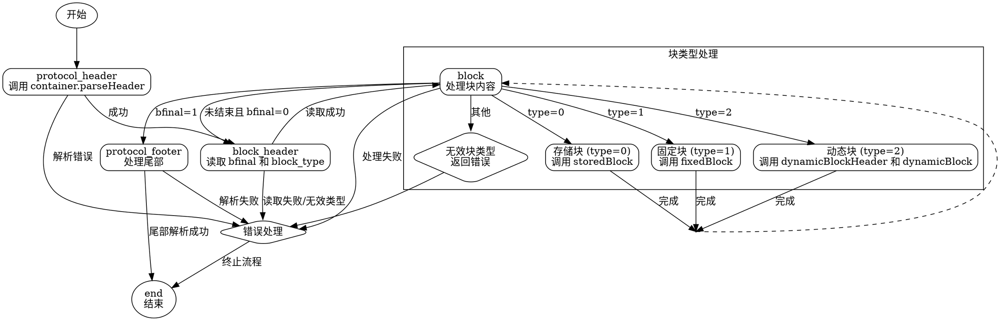

嗯，我需要为提供的Zig代码生成一个流程图。首先，我得仔细看一下代码的结构和功能。这个函数看起来是一个解压缩算法，可能属于Flate（如DEFLATE）的实现。函数名为`Inflate`，返回一个结构体类型，包含各种方法和状态。

首先，我需要理解代码的主要流程。结构体内部有`step`函数，它根据不同的状态（`ReadState`）执行不同的操作。状态包括协议头、块头、块处理、协议尾部、结束等。每个状态对应不同的处理步骤，比如解析头部、处理存储块、固定块或动态块，最后处理尾部。

接下来，我应该确定每个状态之间的转换关系。例如，初始状态是`protocol_header`，处理完后转到`block_header`，然后是`block`，根据块类型（存储、固定、动态）处理相应的块，处理完成后根据`bfinal`标志决定是否进入协议尾部或回到块头。

在处理每个块时，可能需要调用不同的方法，如`storedBlock`、`fixedBlock`、`dynamicBlock`。这些方法内部可能涉及位操作、缓冲区写入等。同时，错误处理也是关键，每个步骤都可能返回错误，需要在流程图中体现可能的错误路径。

需要注意的是，流程图应使用Graphviz的DOT语言，而不是Mermaid。需要定义各个节点（状态或处理步骤）和它们之间的转换箭头。每个节点代表一个处理阶段或决策点，箭头表示流程方向，条件或结果可能需要用标签说明。

可能的结构如下：
1. 开始于`protocol_header`，调用`container.parseHeader`。
2. 转到`block_header`，读取`bfinal`和`block_type`。
3. 根据`block_type`进入不同的块处理：0（存储块）、1（固定块）、2（动态块）。
4. 块处理完成后，检查`bfinal`是否为1，决定是否进入`protocol_footer`。
5. `protocol_footer`处理尾部，最终进入`end`状态。

此外，`get`方法负责从历史缓冲区读取数据，并在需要时调用`step`来推进处理流程。这可能在流程图中表现为循环，直到缓冲区有数据或到达结束状态。

需要确保所有可能的路径都被覆盖，包括错误处理路径。例如，无效的块类型会导致错误返回，动态块头部解析失败也会返回错误。

最后，流程图应清晰展示状态转换和处理步骤，确保逻辑正确且易于理解。
================================================
