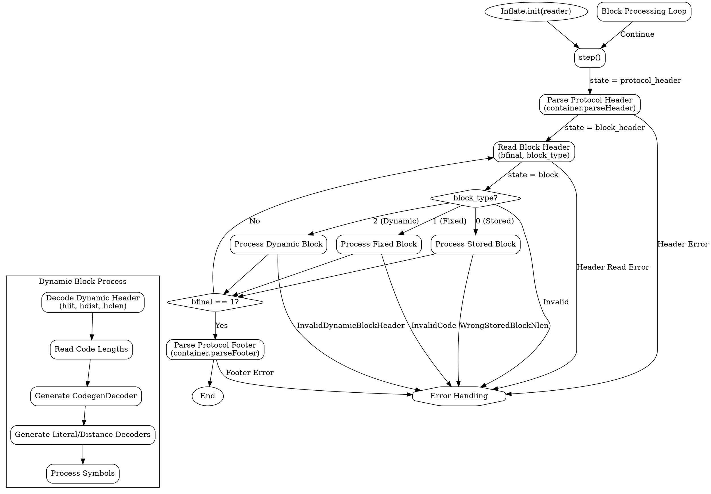

嗯，我需要为提供的Zig代码中的`Inflate`函数绘制一个流程图。首先，我需要理解这个函数的结构和逻辑。看起来这是一个用于解压缩数据的函数，可能实现了DEFLATE算法。代码中有多个方法，比如`blockHeader`、`storedBlock`、`fixedBlock`、`dynamicBlock`等，这些应该对应不同的解压步骤或块类型。

首先，我应该确定主要的流程入口。`init`函数初始化结构体，`decompress`函数可能是主要的解压入口。然后，`step`函数可能控制着解压的不同阶段，如协议头、块头、块处理、协议尾等。每个阶段可能有不同的处理逻辑，比如处理固定块、动态块或存储块。

接下来，我需要将这些步骤转化为流程图中的节点和分支。可能的流程是：从协议头开始，解析头部信息，然后进入块头处理，判断块类型（存储块、固定块、动态块），根据不同的块类型执行相应的解压操作，处理完成后检查是否还有更多块（根据`bfinal`标志），最后处理协议尾并结束。

需要注意的是，流程中可能涉及循环和条件判断，比如在处理动态块时需要解码哈夫曼编码，这可能包含多个步骤和可能的错误处理。此外，错误处理（如返回错误码）也需要在流程图中体现。

可能的结构：
1. 开始于`init`初始化。
2. 进入`step`函数，根据当前状态处理不同阶段。
3. 协议头处理。
4. 块头处理，读取`bfinal`和`block_type`。
5. 根据`block_type`选择处理存储块、固定块或动态块。
6. 处理完块后，检查`bfinal`是否为1，决定是否进入协议尾处理。
7. 处理协议尾，结束流程。

需要确保每个状态转换和条件分支都被正确表示，包括可能的错误路径。此外，像`dynamicBlockHeader`这样的函数可能包含复杂的逻辑，需要进一步分解。

可能需要使用不同的形状表示开始/结束、处理步骤、条件判断等。例如，矩形框表示处理步骤，菱形表示条件判断，箭头表示流程方向，虚线或不同颜色表示错误路径。

最后，使用Graphviz的DOT语言将这些元素组织起来，确保逻辑清晰，层次分明。
================================================
