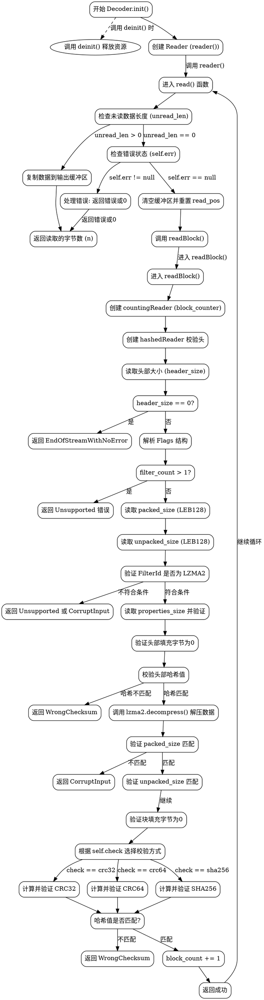

嗯，我需要为提供的Zig代码中的Decoder函数绘制一个流程图。首先，我需要理解这段代码的结构和逻辑。看起来这是一个用于解压缩XZ格式块的解码器。代码中有一个结构体，包含初始化、释放资源、读取数据和处理块的方法。

首先，我应该确定主要的函数和流程。主函数是read和readBlock。read函数处理从缓冲区读取数据，而readBlock负责解析块头、解压数据以及验证校验和。

流程图的起点应该是Decoder结构体的初始化，然后进入read函数。在read函数中，它会检查是否有未读的数据，如果有，则复制到输出缓冲区。如果没有，则检查是否有错误，或者是否需要读取新的块。如果需要读取新块，就调用readBlock函数。

在readBlock函数中，流程包括读取块头，验证头部的校验和，处理可能的压缩数据（比如使用LZMA2解压），然后验证数据的大小和校验和（如CRC32、CRC64或SHA256）。每一步都可能出现错误，需要处理错误情况。

需要注意的是，流程图应该包括条件判断，比如是否有未读数据、是否有错误发生、块头是否有效、校验和是否匹配等。同时，循环结构也需要表示，例如在read函数中的while循环，以及在处理块填充时的循环。

还需要考虑不同校验方式的处理分支，如none、crc32、crc64、sha256等。每个分支有不同的验证步骤，需要分别表示。

最后，流程图的结束点可能是返回读取的字节数，或者返回错误信息。

现在需要将这些步骤用Graphviz的DOT语言表示出来。每个函数调用、条件判断、循环和错误处理都需要对应的节点和边。可能需要使用不同的形状来表示不同的元素，比如矩形表示过程，菱形表示判断，平行四边形表示输入输出等。

要确保流程图的逻辑与代码一致，不漏掉任何关键步骤，尤其是错误处理和资源释放的部分。此外，需要注意函数之间的调用关系，比如read调用readBlock，而readBlock内部可能调用其他解压函数和校验函数。

可能需要将整个流程分成几个子图，比如主流程、read函数流程、readBlock流程，以及各个校验分支。但Graphviz的DOT语言中子图主要用于集群，可能更适合将整个流程作为一个大图，用节点和边连接各个步骤。

最后，检查是否有遗漏的条件或步骤，确保流程图准确反映代码的执行路径。
================================================


该流程图使用 Graphviz DOT 语言描述了 `Decoder` 的主要逻辑流程：
1. **初始化**和资源释放通过 `init` 和 `deinit` 表示。
2. **读取循环**在 `read()` 中处理缓冲区检查和错误状态。
3. **块解析** (`readBlock()`) 包含头部验证、解压、大小校验和哈希验证。
4. **错误路径**用红色菱形节点标注（实际渲染时需配置颜色）。
5. 关键校验分支（CRC32/CRC64/SHA256）通过条件节点展开。

使用时可通过 Graphviz 工具渲染为 PNG/SVG 等格式，例如：
```bash
dot -Tpng decoder_flow.dot -o decoder_flow.png
```