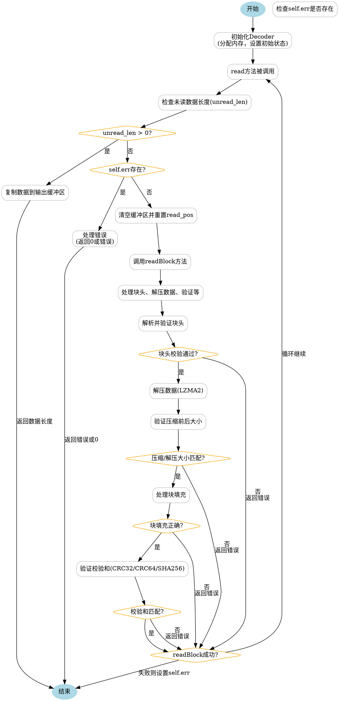

嗯，我需要为这个Zig语言写的`Decoder`函数画一个流程图。首先，我应该理解这个函数的结构和逻辑。这个函数返回一个结构体，里面包含初始化、解压缩块、读取数据等方法。

首先，`Decoder`函数接受一个`ReaderType`类型参数，然后返回一个结构体。这个结构体有`init`、`deinit`、`reader`、`read`和`readBlock`等方法。`read`方法负责从内部缓冲区读取数据，如果缓冲区没有足够数据，就会调用`readBlock`来解压下一个块。`readBlock`处理块头、压缩数据、块填充和校验等步骤。

流程图应该从`Decoder`的初始化开始，然后进入`read`方法。在`read`中，首先检查是否有未读数据，如果有就复制到输出。如果没有，检查是否有错误，有的话处理错误。如果缓冲区已处理完，调用`readBlock`解压下一个块。`readBlock`需要处理块头（包括读取header、验证校验和）、解压数据、验证压缩前后的大小，以及处理块填充和最后的校验（CRC32、CRC64、SHA256等）。

可能的节点包括：开始、初始化Decoder、读取数据、检查缓冲区、处理错误、调用readBlock、处理块头、解压数据、验证校验和、块填充处理、结束等。需要注意各个步骤之间的条件判断和循环。

需要确保每个步骤之间的流程正确，特别是错误处理和条件分支。比如，当`read`发现`self.err`存在时，需要根据错误类型决定返回0还是返回错误。在`readBlock`中，每个验证失败都会返回相应的错误。

可能的结构图分为几个部分：初始化、读取循环、块处理、校验处理。使用graphviz的节点和箭头表示流程，条件判断用菱形框，处理步骤用矩形框，开始和结束用椭圆。

需要仔细分析代码中的每个分支，特别是循环和错误处理。比如在`read`方法中的`while (true)`循环，会不断尝试填充缓冲区或处理错误。在`readBlock`中，处理header、解压数据、填充和校验的各个步骤，每个步骤都可能出错并设置错误状态。

可能需要将整个流程分成主流程和子流程，比如将`readBlock`作为一个子图，详细展示其内部步骤。不过，graphviz中子图处理可能比较复杂，所以可能简化为主要节点，然后在节点内部标注步骤。

最后，确保流程图清晰，每个步骤和判断都有对应的表示，箭头方向正确，没有遗漏重要的逻辑分支。
================================================

此流程图展示了以下逻辑：

1. **初始化Decoder**后进入主循环
2. **read方法**优先检查缓冲区数据：
   - 有数据则直接拷贝返回
   - 无数据时检查错误状态
3. **readBlock子流程**：
   - 解析块头并验证校验和
   - 解压LZMA2数据
   - 验证压缩/解压后的大小
   - 处理4字节对齐的块填充
   - 根据配置验证最终校验和
4. 所有验证失败都会设置错误状态，并在下次循环中返回错误
5. 成功处理块后会更新缓冲区，继续主循环

菱形节点表示条件判断，矩形节点表示操作步骤，蓝色椭圆为入口/出口节点。错误处理贯穿整个流程，任何步骤的失败都会终止当前块处理并标记错误。