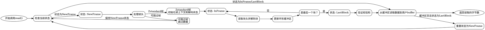

好的，我现在要帮用户分析他们提供的Zig代码，并生成对应的流程图。首先，我需要仔细阅读这段代码，理解它的结构和功能。代码是一个Zig语言实现的解压缩器，属于zstandard压缩算法的部分。函数名为Decompressor，接收一个ReaderType类型参数，返回一个结构体类型。这个结构体内部有多个状态和方法，比如init、reader、read、readInner等。

首先，我需要确定这个解压缩器的工作流程。从代码来看，Decompressor结构体有一个状态机，可能包括NewFrame、InFrame、LastBlock等状态。初始化时，状态是NewFrame，当开始处理帧时，会进入InFrame，处理完最后一个块后进入LastBlock，最后可能回到NewFrame。

接下来，分析主要的函数。init函数用于初始化结构体的各个字段，设置初始状态。reader方法返回一个Reader对象，用于读取解压后的数据。read方法是主要的入口，它会循环处理帧，直到有数据可以输出。readInner则是实际处理数据读取的内部方法，涉及块解码、校验和验证等。

在绘制流程图时，需要将整个解压过程分解成步骤。例如，初始状态是NewFrame，然后进入循环处理帧头，如果是可跳过的帧，则跳过；如果是zstandard帧，则初始化帧上下文和解码状态，进入InFrame状态。在InFrame状态下，处理各个数据块，直到遇到最后一个块，进入LastBlock状态，验证校验和，最后重置状态为NewFrame，继续处理下一帧。

需要注意错误处理部分，比如遇到不支持的字典ID、校验和失败、格式错误等，都需要在流程图中体现出来。此外，缓冲区的管理、字面量和序列的解码也是关键步骤。

可能的流程步骤包括：
1. 初始化Decompressor，设置初始状态为NewFrame。
2. 在read方法中，检查当前状态是否为NewFrame，如果是，处理帧头。
3. 处理帧头时，如果是可跳过的帧，跳过数据并保持NewFrame状态。
4. 如果是zstandard帧，初始化帧上下文和解码状态，切换到InFrame状态。
5. 在InFrame状态下，读取块头，解码块数据，更新缓冲区。
6. 检查是否为最后一个块，如果是，切换到LastBlock状态，验证校验和。
7. 从缓冲区读取数据到用户提供的buffer中。
8. 如果缓冲区为空且状态为LastBlock，重置状态为NewFrame，准备处理下一帧。
9. 处理过程中遇到错误时，返回相应的错误码。

在绘制流程图时，需要使用不同的节点表示状态转换、函数调用、条件判断和循环。例如，菱形节点表示条件判断（如是否是最后一个块），矩形节点表示处理步骤（如解码块数据），箭头表示流程方向，并标注条件或操作。

需要确保流程图的逻辑与代码一致，特别是状态转换和错误处理部分。可能需要多次检查代码逻辑，确认各个状态之间的转换条件和处理步骤的正确性。

最后，生成Graphviz的DOT语言代码，使用正确的节点和边来表示整个流程，确保结构清晰，易于理解。
================================================

该流程图展示了以下关键路径：
1. 初始进入read()方法检查状态
2. 处理NewFrame状态时的帧头解析
3. InFrame状态下的块解码循环
4. LastBlock状态的校验和验证
5. 缓冲数据读取和状态重置逻辑
6. 错误处理路径隐含在菱形决策节点中（如校验失败会终止流程）

各节点使用不同形状表示：
- 椭圆：开始/结束节点
- 圆角矩形：处理步骤
- 菱形：条件判断
- 箭头标注了状态转换条件和数据流向