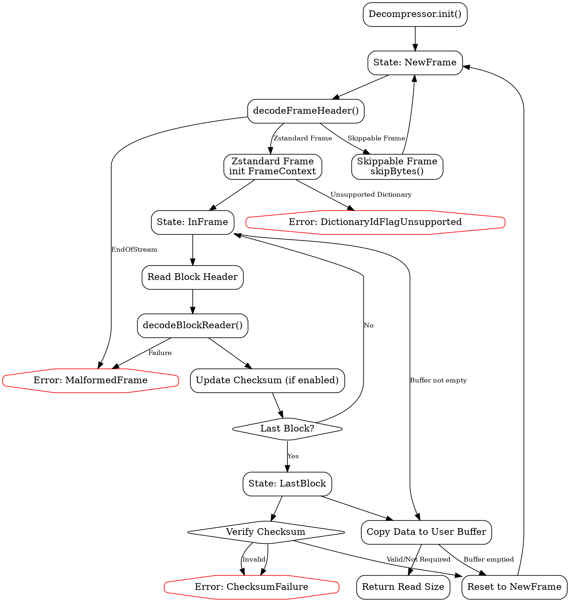

嗯，用户让我用Graphviz来画这个Zig函数的流程图。首先，我需要理解这个Decompressor函数的结构和工作流程。看起来这是一个Zstandard解压缩器的实现，结构体里有很多状态和缓冲区。

首先，我需要确定主要的状态转换。代码中有几个状态：NewFrame、InFrame、LastBlock。流程应该从初始化开始，进入NewFrame状态，处理帧头，然后进入InFrame处理数据块，最后到LastBlock处理校验和等收尾工作。

接下来，要分析read函数和readInner函数的逻辑。read函数会不断检查状态，如果是NewFrame就初始化帧，然后调用readInner读取数据。readInner负责处理具体的块解码，包括读取块头、解码数据、更新缓冲区，以及处理校验和和内容大小验证。

需要注意错误处理，比如遇到不支持的特性或格式错误时抛出错误。还有在处理每个块时的循环，直到所有数据被读取或缓冲区填满。

在绘制流程图时，应该用不同的节点表示状态转换、函数调用、条件判断和循环。例如，开始于init，进入NewFrame状态，处理帧头，可能跳过skippable帧或进入Zstandard帧处理。然后进入InFrame状态，循环处理每个块，直到LastBlock，最后回到NewFrame。

还要考虑缓冲区操作，如ring_buffer的读写，以及校验和的计算和验证。这些步骤需要在流程图中体现出来，可能作为处理块的一部分。

需要确保所有可能的路径都被覆盖，包括错误路径，比如校验和失败或格式错误导致的异常退出。但用户可能希望流程图主要关注正常流程，错误处理作为分支。

最后，用Graphviz的语法来组织这些节点和边，使用正确的形状（如菱形表示判断，矩形表示过程）和箭头连接各个步骤。确保逻辑清晰，层次分明，方便理解整个解压缩流程。
================================================
