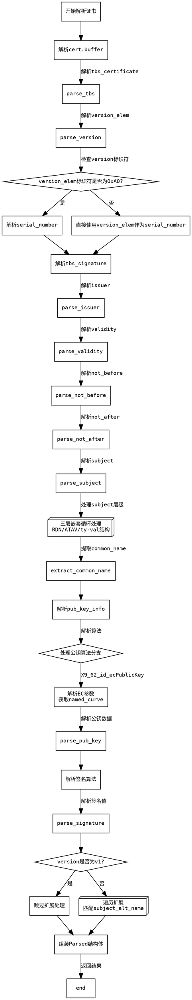

嗯，我需要为这个Zig语言编写的parse函数绘制一个流程图。首先，我应该仔细阅读代码，理解每个步骤的作用。这个函数看起来是在解析证书的结构，按照DER编码格式逐步处理各个字段。

首先，函数开始于解析cert.buffer，然后使用der.Element.parse多次处理不同的部分，比如tbs_certificate、version、serial_number等。接下来处理签名、发行者、有效期、主题、公钥信息等等。中间有很多条件判断和循环，比如处理主题中的通用名称（common name），以及处理扩展部分（extensions）。

需要注意的是，流程图中需要展示各个步骤的顺序，条件分支（比如if和switch语句），以及循环结构（比如while循环）。例如，处理subject部分时有三个嵌套的while循环，用来遍历RDN、ATAV等结构。此外，扩展部分有一个break语句，需要表示出条件判断后的流程分支。

可能容易出错的地方包括正确识别各个解析步骤的依赖关系，以及条件判断和循环的边界。例如，在处理版本号时，有一个条件判断检查版本元素标识符是否为0xa0，这会影响serial_number的解析路径。另外，在处理扩展时，如果版本是v1，则跳过扩展处理，否则继续解析。

我需要确保流程图中的每个步骤都正确对应代码中的逻辑，特别是条件分支和循环部分。同时，要注意各个解析步骤之间的顺序，例如解析完tbs_certificate后才能解析version，依此类推。

最后，生成的流程图应该使用Graphviz的DOT语言，正确使用节点、箭头、条件判断框和循环结构来表示整个解析过程。需要避免使用Mermaid语法，严格遵循Graphviz的规范。
================================================

该流程图使用Graphviz的DOT语言绘制，主要特点包括：
1. 用菱形表示条件判断（如版本标识符检查和版本号判断）
2. 用3D方框表示复杂处理逻辑（如三层嵌套循环处理subject层级）
3. 箭头标注了代码中的关键解析步骤顺序
4. 分支路径清晰展示了不同条件下的处理流程
5. 包含了证书解析的核心路径：从tbs证书到签名算法，再到扩展处理的完整流程
6. 最终通过collect_results节点汇总所有解析结果并返回